**TRƯỜNG ĐẠI HỌC CÔNG NGHỆ THÔNG TIN VÀ**

**TRUYỀN THÔNG VIỆT – HÀN**

**KHOA KHOA HỌC MÁY TÍNH**

---

ĐỒ ÁN CƠ SỞ 4

**ĐỀ TÀI: XÂY DỰNG ỨNG DỤNG MOBILE STAYFINDER**

**TÌM CHỖ Ở THÔNG MINH TẠI ĐÀ NẴNG**

**TÍCH HỢP AI/RAG**

Sinh viên thực hiện: \[Họ và tên sinh viên\]

Lớp: **Đồ án cơ sở 4 (ITe)**

Giảng viên hướng dẫn: **\[Học vị – Họ tên giảng viên\]**

***Đà Nẵng, tháng 12 năm 2025***

---

# **LỜI CẢM ƠN**

Đầu tiên, em xin gửi lời cảm ơn chân thành đến giảng viên hướng dẫn đã dành thời gian quý báu, tận tâm hướng dẫn và góp ý xuyên suốt quá trình thực hiện đồ án. Những định hướng kỹ thuật, phản hồi về kiến trúc hệ thống và cách trình bày báo cáo đã giúp đồ án hoàn thiện hơn rất nhiều.

Em cũng xin gửi lời cảm ơn đến quý thầy cô Khoa Khoa học máy tính, Trường Đại học Công nghệ thông tin và Truyền thông Việt – Hàn đã trang bị cho em nền tảng kiến thức về phát triển ứng dụng, cơ sở dữ liệu, hệ thống phân tán và trí tuệ nhân tạo — những kiến thức cốt lõi để triển khai một sản phẩm tích hợp dữ liệu thực, backend API và lớp AI/RAG như StayFinder.

Cuối cùng, em xin gửi lời cảm ơn đến gia đình, bạn bè đã đồng hành, hỗ trợ kiểm thử ứng dụng trên nhiều thiết bị Android khác nhau, và động viên tinh thần trong suốt thời gian thực hiện đồ án.

Do thời gian và kinh nghiệm còn hạn chế, đồ án không tránh khỏi những thiếu sót. Em rất mong nhận được những ý kiến đóng góp quý báu của quý thầy cô để sản phẩm tiếp tục được hoàn thiện trong các giai đoạn phát triển tiếp theo.

Em xin chân thành cảm ơn.

Sinh viên thực hiện

**\[Họ và tên sinh viên\]**

---

# **NHẬN XÉT**

**(Của giảng viên hướng dẫn)**

………………………………………………………………………………………………………………………………………………………………………………………………………………………………………………………………………………………………………………………………………………………………………………………………………………………………………………………………………………………………………………………………………………………………………………………………………………………………………………………………………………………………………………………………………………………………………………………………………………………………………………………………………………………………………………………………………………………………

---

**MỤC LỤC**

- LỜI CẢM ƠN
- NHẬN XÉT
- MỞ ĐẦU
  - 1\. Tính cấp thiết của đề tài
  - 2\. Mục tiêu và nhiệm vụ nghiên cứu
  - 3\. Đối tượng và phạm vi nghiên cứu
  - 4\. Phương pháp nghiên cứu
- CHƯƠNG 1: CƠ SỞ LÝ THUYẾT VÀ CÔNG NGHỆ
  - 1.1. Tổng quan về phát triển ứng dụng mobile đa nền tảng
  - 1.2. Framework React Native và Expo Router
  - 1.3. Ngôn ngữ TypeScript
  - 1.4. Backend Node.js và Express
  - 1.5. Cơ sở dữ liệu PostgreSQL trên Supabase
  - 1.6. Vector database và pgvector
  - 1.7. RAG (Retrieval-Augmented Generation) và LLM
  - 1.8. Pipeline crawl dữ liệu với Apify
  - 1.9. Các thư viện hỗ trợ khác
- CHƯƠNG 2: PHÂN TÍCH VÀ THIẾT KẾ HỆ THỐNG
  - I. PHÂN TÍCH HỆ THỐNG
    - 1\. Bối cảnh và mục tiêu, phạm vi hệ thống
    - 2\. Phân tích yêu cầu (Business / Functional / Non-Functional)
    - 3\. Đối tượng người dùng
    - 4\. Đặc tả Ca sử dụng (Use Cases)
    - 5\. Ma trận truy vết yêu cầu
    - 6\. Phân tích rủi ro
  - II. THIẾT KẾ HỆ THỐNG
    - 1\. Kiến trúc hệ thống
    - 2\. Thiết kế Cơ sở dữ liệu (PostgreSQL Schema)
    - 3\. Thiết kế API (REST contract)
    - 4\. Thiết kế pipeline dữ liệu và AI/RAG
    - 5\. Thiết kế UML (Class, Activity, Sequence)
    - 6\. Thiết kế bảo mật và xử lý lỗi
- CHƯƠNG 3: DEMO GIAO DIỆN ỨNG DỤNG
- KẾT LUẬN
- TÀI LIỆU THAM KHẢO

---

**DANH MỤC HÌNH ẢNH**

- Hình 1. Sơ đồ Use Case tổng quát
- Hình 2. Sơ đồ kiến trúc tổng thể (System Context)
- Hình 3. Sơ đồ kiến trúc theo Container
- Hình 4. Sơ đồ kiến trúc bên trong Mobile App
- Hình 5. Sơ đồ kiến trúc Backend API + RAG Pipeline
- Hình 6. Sơ đồ ERD quan hệ tổng quát các bảng
- Hình 7. Class Diagram domain
- Hình 8. Activity Diagram: pipeline dữ liệu Crawl → Import → RAG
- Hình 9. Activity Diagram: luồng tìm kiếm & xem chi tiết
- Hình 10. Activity Diagram: luồng Chat AI
- Hình 11. Sequence Diagram: GET /places (Search)
- Hình 12. Sequence Diagram: GET /places/:id (Detail)
- Hình 13. Sequence Diagram: POST /chat/query (Chat AI RAG)
- Hình 14. Sequence Diagram: POST /ai/review-summary (Tóm tắt review AI)
- Hình 15. State Diagram: vòng đời cache AI review summary
- Hình 16. Sơ đồ triển khai (Deployment)
- Hình 17. Giao diện Splash
- Hình 18. Giao diện Home / tìm kiếm nhanh
- Hình 19. Giao diện Results / Filter Sheet
- Hình 20. Giao diện Place Detail
- Hình 21. Giao diện AI Review Summary
- Hình 22. Giao diện Chat AI
- Hình 23. Giao diện Saved
- Hình 24. Giao diện Profile

---

# **MỞ ĐẦU**

## **1. Tính cấp thiết của đề tài**

Đà Nẵng là một trong những trung tâm du lịch và công tác lớn nhất của miền Trung Việt Nam. Lượng khách lưu trú tăng nhanh trong những năm gần đây kéo theo sự bùng nổ của các loại hình lưu trú đa dạng: khách sạn, homestay, nhà nghỉ, căn hộ dịch vụ, hostel,… Tuy nhiên, người dùng — đặc biệt là du khách lần đầu đến Đà Nẵng — vẫn gặp nhiều khó khăn trong quá trình tìm kiếm và ra quyết định:

- **Thông tin phân tán** trên nhiều nền tảng (Google Maps, OTA, mạng xã hội, fanpage), người dùng khó tổng hợp và so sánh tổng quan.
- **Tìm kiếm theo ngữ cảnh địa phương còn thủ công**: muốn ở "gần biển Mỹ Khê", "gần Cầu Rồng", "gần sân bay Đà Nẵng", "gần phố Tây An Thượng" thì hiện tại phải tự mở bản đồ và đo bằng mắt.
- **Hàng nghìn review dài, đa ngôn ngữ, thiếu cấu trúc**: rất khó rút ra điểm mạnh - điểm yếu của từng nơi ở chỉ trong vài phút.
- **Trải nghiệm trên mobile chưa thực sự thống nhất**: các bước khám phá → lọc → xem chi tiết → so sánh → ra quyết định thường bị đứt đoạn giữa nhiều ứng dụng khác nhau.
- **Thiếu lớp tư vấn cá nhân hóa**: người dùng có nhu cầu "đi gia đình, có trẻ nhỏ, gần biển, yên tĩnh, giá ổn" nhưng hệ thống filter cứng nhắc của các app hiện có không hiểu được mô tả tự nhiên này.

Bên cạnh đó, các công nghệ mới trong lĩnh vực Trí tuệ nhân tạo — đặc biệt là **LLM (Large Language Model)** kết hợp với **RAG (Retrieval-Augmented Generation)** — đã trở nên đủ chín muồi và đủ giá thành để có thể đưa vào ứng dụng sản phẩm thực tế ở quy mô đồ án. Việc tích hợp RAG giúp chatbot trả lời chính xác trên **dữ liệu thật của hệ thống**, hạn chế tối đa hiện tượng "bịa đặt" của LLM thuần.

Từ thực tế đó, đề tài **"Xây dựng ứng dụng mobile StayFinder tìm chỗ ở thông minh tại Đà Nẵng, tích hợp AI/RAG"** được lựa chọn nhằm giải quyết đồng thời ba bài toán quan trọng:

1. **Bài toán dữ liệu**: thu thập, chuẩn hóa và quản trị dataset chỗ ở Đà Nẵng theo batch, đảm bảo có thể truy vết và tái lập.
2. **Bài toán truy vấn**: cung cấp REST API cho mobile với khả năng lọc đa tiêu chí (loại hình, khu vực, tiện ích, landmark, rating, khoảng cách,…).
3. **Bài toán trải nghiệm**: xây dựng ứng dụng mobile gọn, hiện đại, có thêm hai lớp giá trị AI — **Chat tư vấn** và **Tóm tắt review tự động** — để rút ngắn thời gian ra quyết định cho người dùng.

Đề tài có tính thực tiễn cao, gắn liền với một thành phố cụ thể (Đà Nẵng), đồng thời mở ra hướng nghiên cứu áp dụng RAG vào các bài toán tìm kiếm/khám phá điểm đến (place discovery) tại Việt Nam.

## **2. Mục tiêu và nhiệm vụ nghiên cứu**

**Mục tiêu nghiên cứu**

- Xây dựng một **ứng dụng mobile đa nền tảng** (Android-first, vẫn cross-platform iOS/Web) phục vụ tìm kiếm chỗ ở tại Đà Nẵng.
- Thiết kế và triển khai **backend REST API** chuẩn để mobile app, web demo và pipeline AI cùng tiêu thụ một nguồn dữ liệu nhất quán.
- Xây dựng **pipeline dữ liệu hoàn chỉnh**: crawl → chuẩn hóa raw/compact → import idempotent vào Postgres → build chunk → embed vector.
- Triển khai **chatbot tư vấn lưu trú bằng RAG**, không trả lời ngoài dữ liệu, có khả năng kết hợp filter cấu trúc + semantic retrieval.
- Triển khai **AI Review Summary** sinh tóm tắt review theo từng địa điểm, có cache để giảm chi phí gọi mô hình.
- Đảm bảo trải nghiệm UX trên mobile: dễ thao tác một tay, đủ trạng thái loading/empty/error, tránh đứt mạch quyết định.

**Nhiệm vụ nghiên cứu**

- Nghiên cứu kiến trúc Mobile (React Native + Expo Router), Backend (Node.js + Express), Database (Supabase Postgres + extension pgvector).
- Nghiên cứu lý thuyết RAG, hybrid retrieval (SQL filter + vector search), kỹ thuật chunking và embedding 1536-chiều.
- Phân tích nghiệp vụ, thiết kế use case, sơ đồ kiến trúc, ERD, class diagram, activity và sequence diagram cho toàn hệ thống.
- Thiết kế hợp đồng dữ liệu (data contract) giữa backend ↔ mobile (PlaceSummary, PlaceDetail, FiltersMeta, LandmarkMetric, ChatResponse, ReviewSummary).
- Triển khai 8+ endpoint REST public và 10+ endpoint admin cho quản trị places, landmarks, jobs.
- Triển khai 9+ màn hình trên mobile: Splash, Home, Results, Filter Sheet, Map View, Place Detail, AI Review Summary, Chat AI, Saved/Recent, Profile.
- Kiểm thử end-to-end: import lặp lại không trùng, RAG không bịa đặt, mobile flow xuyên suốt Home → Results → Detail → Chat.

## **3. Đối tượng và phạm vi nghiên cứu**

**Đối tượng nghiên cứu**

- Bài toán tìm kiếm và khám phá chỗ ở ngắn hạn tại Đà Nẵng.
- Người dùng cuối có nhu cầu lưu trú (du lịch, công tác, gia đình, đi nhóm bạn).
- Dữ liệu địa điểm lưu trú thu thập từ Google Maps thông qua Apify Actor, được chuẩn hóa thành dataset compact.
- Công nghệ: React Native, Expo Router, TypeScript, Node.js, Express, PostgreSQL (Supabase), pgvector, LLM tương thích OpenAI API, Python (LangChain/RAG pipeline).

**Phạm vi nghiên cứu**

- **Phạm vi địa lý**: tập trung dữ liệu Đà Nẵng (v1). Các thành phố khác để dành cho giai đoạn mở rộng.
- **Phạm vi nền tảng**: mobile app (Android là chính, vẫn build được iOS/Web), backend REST API, web admin tối giản.
- **Phạm vi chức năng**:
  - Khám phá và tìm kiếm chỗ ở theo từ khóa, loại hình, khu vực, tiện ích, landmark.
  - Lọc nâng cao và sắp xếp kết quả theo rating, lượng review, khoảng cách, tên.
  - Xem chi tiết địa điểm: ảnh gallery, mô tả, tiện ích, review mẫu, khoảng cách tới landmark.
  - Lưu địa điểm yêu thích trên thiết bị (chưa đồng bộ cloud trong v1).
  - Chat AI tư vấn lưu trú có ngữ cảnh địa phương Đà Nẵng (Cầu Rồng, Cầu Sông Hàn, biển Mỹ Khê, sân bay, chợ Hàn, Ngũ Hành Sơn, An Thượng, Sơn Trà).
  - Tóm tắt review bằng AI ở màn Detail.
  - Web admin: quản lý places / landmarks / local context notes, chạy lại job distance hoặc job AI theo batch hoặc theo place.
- **Phạm vi dữ liệu và AI**:
  - 1.646+ địa điểm lưu trú Đà Nẵng (batch v1 đã freeze).
  - 8 landmark địa phương quan trọng.
  - Embedding 1536-chiều dùng cho semantic retrieval.
  - LLM mặc định: model `gpt-5.5` qua provider OpenAI-compatible.
- **Phạm vi ngoài đề tài**:
  - Đặt phòng/thanh toán trực tiếp trong app.
  - Voice/Video call, chat giữa các người dùng.
  - Đa thành phố ngoài Đà Nẵng (chỉ chuẩn bị schema để mở rộng sau).
  - Huấn luyện foundation model riêng.

## **4. Phương pháp nghiên cứu**

- **Phương pháp nghiên cứu lý thuyết**: tổng hợp tài liệu chính thức về React Native, Expo, Supabase/PostgreSQL, pgvector, RAG, LangChain, OpenAI-compatible API.
- **Phương pháp phân tích, thiết kế**: phân tích yêu cầu nghiệp vụ → trích xuất use case → thiết kế kiến trúc 4 lớp (Mobile/API/DB/RAG) → thiết kế schema CSDL → thiết kế hợp đồng API → thiết kế UML.
- **Phương pháp phát triển lặp (iterative)**: chia dự án thành 6 phase độc lập (Phase 0 freeze data → Phase 1 landmarks/distance → Phase 2 RAG → Phase 3 backend → Phase 4 mobile → Phase 5 admin). Mỗi phase có tiêu chí "Definition of Done" rõ ràng.
- **Phương pháp kiểm thử thực nghiệm**: kiểm thử thủ công end-to-end trên Android, đo thời gian phản hồi API, kiểm thử bộ 20–30 prompt cho chatbot RAG để xác nhận không bịa đặt.
- **Phương pháp đối sánh dữ liệu**: dùng `compact` làm source of truth cho UI/API/RAG, dùng `raw` để audit và đối chiếu offline.

---

# **CHƯƠNG 1: CƠ SỞ LÝ THUYẾT VÀ CÔNG NGHỆ**

## **1.1. Tổng quan về phát triển ứng dụng mobile đa nền tảng**

Phát triển mobile đa nền tảng (cross-platform) là cách tiếp cận sử dụng một codebase chung để triển khai trên nhiều hệ điều hành (iOS, Android, đôi khi cả Web). So với phát triển native riêng cho từng nền tảng (Swift cho iOS, Kotlin cho Android), cách tiếp cận này giúp:

- **Rút ngắn thời gian phát triển và bảo trì**: chỉ duy trì một codebase logic và UI chính.
- **Đồng bộ trải nghiệm**: cùng một component, cùng một flow trên cả iOS và Android.
- **Phù hợp đồ án sinh viên**: nguồn lực giới hạn, không thể tách đội theo nền tảng.
- **Dễ tích hợp các lớp AI/dữ liệu** vì backend được dùng chung, mobile chỉ thay đổi UI/UX.

Trong số các giải pháp đa nền tảng hiện nay (React Native, Flutter, Ionic, .NET MAUI), StayFinder lựa chọn **React Native + Expo** vì hệ sinh thái thư viện phong phú, tích hợp tốt với TypeScript, hỗ trợ Expo Router cho điều hướng filesystem-based, và có thể chạy trực tiếp trên Expo Go khi demo.

## **1.2. Framework React Native và Expo Router**

### **1.2.1. React Native**

React Native là framework mã nguồn mở do Meta (Facebook) phát triển từ năm 2015, cho phép xây dựng ứng dụng mobile bằng JavaScript/TypeScript nhưng vẫn render ra **native UI components** thay vì WebView.

**Đặc điểm nổi bật**

- **Component-based**: kế thừa mô hình React, dễ tái sử dụng UI.
- **Native performance**: bridge nối giữa JavaScript runtime và native modules.
- **Hot Reload / Fast Refresh**: giảm thời gian phát triển.
- **Hệ sinh thái lớn**: navigation, animation, image, network… đều có thư viện trưởng thành.

**Vì sao phù hợp với StayFinder**

- Màn Results là danh sách dài có ảnh và nhiều card → React Native xử lý tốt với `FlatList`.
- Màn Chat AI cần animation mượt khi hiển thị bong bóng tin nhắn → tận dụng `react-native-reanimated`.
- Map view và Filter Sheet cần tương tác mượt → các thành phần `Bottom Sheet` và `PressableScale` đáp ứng tốt.

### **1.2.2. Expo SDK**

Expo là platform/toolchain trên React Native, cung cấp managed workflow giúp loại bỏ phần lớn cấu hình native phức tạp.

**Đặc điểm**

- **Managed Workflow**: lập trình viên không cần đụng đến Xcode/Android Studio trong giai đoạn phát triển.
- **Expo Go**: test app trực tiếp trên thiết bị thực qua QR code.
- **EAS Build**: build APK/IPA trên cloud của Expo.
- **OTA Updates**: cập nhật JS bundle không cần phát hành lại store.

**Các module Expo dùng trong StayFinder**

- `expo-router`: điều hướng filesystem-based.
- `expo-image`: load ảnh hiệu năng cao, hỗ trợ cache.
- `expo-constants`: lấy `hostUri` để auto-detect API base URL khi chạy trên máy thật.
- `expo-haptics`: phản hồi rung khi vuốt xóa ở Saved.
- `expo-linking`: mở Google Maps, gọi điện thoại từ Place Detail.
- `expo-status-bar`: kiểm soát status bar theo theme.

### **1.2.3. Expo Router**

Expo Router là router filesystem-based dựa trên React Navigation v7. Mỗi file trong thư mục `app/` tự động trở thành route.

**Cấu trúc route của StayFinder**

```
mobile/app/
├── splash.tsx                 → / (splash khởi động)
├── _layout.tsx                → root layout
├── (tabs)/                    → group tab
│   ├── _layout.tsx            → bottom tab bar (5 tabs)
│   ├── home.tsx               → /home
│   ├── results.tsx            → /results
│   ├── saved.tsx              → /saved
│   ├── chat.tsx               → /chat
│   └── profile.tsx            → /profile
├── place/[place-id].tsx       → /place/:place-id (Detail)
├── ai-review/[place-id].tsx   → /ai-review/:place-id (AI Summary mở rộng)
├── filter-sheet.tsx           → /filter-sheet (Filter modal)
└── +not-found.tsx             → 404
```

**Ưu điểm**: cấu trúc rõ ràng, dễ đọc; deep link tự nhiên; tách stack/tab/modal theo convention.

## **1.3. Ngôn ngữ TypeScript**

TypeScript là superset của JavaScript, thêm static typing và các tính năng nâng cao (interface, generics, discriminated union…). Trong dự án StayFinder, TypeScript được dùng xuyên suốt mobile để:

- **Định nghĩa data contract chặt** với backend: `PlaceSummary`, `PlaceDetail`, `FiltersMeta`, `LandmarkMetric`, `ChatQueryResponse`, `ReviewSummaryResponse`.
- **Giảm lỗi runtime** khi map dữ liệu API về UI.
- **Tăng tốc phát triển** nhờ IntelliSense và auto-complete.
- **Refactor an toàn** khi đổi tên field hoặc đổi shape response.

**Ví dụ type chuẩn hóa cho hợp đồng API**

```typescript
export type PlaceSummary = {
  id: string;
  place_id: string;
  title: string;
  type_slug: string | null;
  district: string | null;
  rating: number | null;
  reviews_count: number | null;
  cover_image: string | null;
  amenities_preview: string[];
  nearest_landmarks: LandmarkMetric[];
};
```

## **1.4. Backend Node.js và Express**

Backend của StayFinder được triển khai bằng **Node.js + Express**, đóng vai trò là **BFF (Backend-for-Frontend)** cho mobile app và web admin.

**Lý do chọn Node.js + Express**

- Cùng ngôn ngữ JavaScript/TypeScript với mobile → đồng bộ data contract dễ dàng.
- Express tối giản, dễ học, đủ cho REST API.
- Hệ sinh thái npm phong phú: `pg` (PostgreSQL), `cors`, `child_process` (gọi script Python RAG).
- Dễ kết nối trực tiếp đến Supabase Postgres bằng connection string.

**Đặc điểm kỹ thuật của backend StayFinder**

- Cấu hình **CORS linh hoạt** qua biến môi trường.
- **Connection pool** tới Postgres.
- **Parser đa tham số** cho query string (multi-value cho `type`, `district`, `amenity`, `landmark`).
- **Chuẩn hóa lỗi** qua middleware: `HttpError`, `badRequest`, `notFound`, `serviceUnavailable`.
- **Async route wrapper** để bắt lỗi async tự động.
- **Gọi script Python** cho RAG qua `spawn` từ `node:child_process` với timeout an toàn.
- **Admin Auth** bằng Bearer token / header `x-admin-token`.
- **Job manager nội bộ** cho các tác vụ chạy nền (rebuild distance, rebuild chunks, rebuild embeddings, rebuild AI review summaries).

## **1.5. Cơ sở dữ liệu PostgreSQL trên Supabase**

**Supabase** là một nền tảng Backend-as-a-Service mã nguồn mở, cung cấp PostgreSQL có quản lý, hệ thống Auth, Storage, Realtime và Edge Functions trên một stack thống nhất. StayFinder chỉ dùng **PostgreSQL + extension `pgvector`** từ Supabase; Auth và Storage có thể được mở rộng sau.

**Vì sao chọn PostgreSQL thay vì NoSQL như Firestore**

- Dữ liệu chỗ ở có **quan hệ N-N rõ ràng** (place ↔ amenities, place ↔ landmarks, place ↔ images, place ↔ reviews).
- Cần **lọc đa tiêu chí phức tạp**: theo type, district, tiện ích, ngưỡng rating, khoảng cách → SQL với index hiệu quả hơn hẳn NoSQL.
- Có **extension `vector`** (pgvector) cho phép semantic retrieval ngay trên cùng database mà không cần thêm hệ thống vector store riêng.
- **Migration version-controlled**: dễ kiểm soát thay đổi schema qua thư mục `supabase/migrations/`.

**Các bảng cốt lõi**

- **Listing**: `places`, `place_images`, `reviews`.
- **Amenity**: `amenities`, `place_amenities` (M:N).
- **Ngữ cảnh địa phương**: `local_landmarks`, `local_zones`, `place_landmark_metrics`, `local_context_notes`.
- **Batch/Audit**: `crawl_batches`.
- **AI/RAG**: `ai_place_chunks` (chunk + embedding 1536-dim), `ai_review_summaries`.

## **1.6. Vector database và pgvector**

**Vector database** là loại CSDL được tối ưu cho việc lưu trữ và truy vấn vector nhiều chiều (thường là embedding của văn bản hoặc ảnh), hỗ trợ **similarity search** bằng metric như cosine, dot product, L2.

**pgvector** là extension của PostgreSQL biến Postgres thành một vector store đúng nghĩa. StayFinder sử dụng pgvector với:

- Kiểu dữ liệu `vector(1536)` cho embedding của chunk.
- Index **HNSW (Hierarchical Navigable Small World)** hoặc IVF Flat cho tìm kiếm xấp xỉ.
- Metric cosine để đo độ tương đồng giữa câu truy vấn và chunk.

Ưu điểm: tận dụng được index, transaction và join SQL của Postgres mà vẫn có khả năng semantic search.

## **1.7. RAG (Retrieval-Augmented Generation) và LLM**

### **1.7.1. Vấn đề của LLM thuần**

LLM (Large Language Model) như GPT, Claude có khả năng sinh ngôn ngữ tự nhiên rất tốt nhưng:

- **Không cập nhật** đến dữ liệu sau ngày huấn luyện.
- **Hallucinate** (bịa) các sự kiện cụ thể như số phòng, giá, khoảng cách, tên homestay, đặc biệt với dữ liệu địa phương.
- **Không truy vết được** câu trả lời về nguồn cụ thể.

Với StayFinder, một câu trả lời như "Khách sạn ABC ngay sát Cầu Rồng, giá 700k/đêm" mà không có trong DB thật sẽ phá vỡ niềm tin người dùng.

### **1.7.2. Nguyên lý RAG**

RAG (Retrieval-Augmented Generation) giải quyết vấn đề trên bằng cách:

1. **Retrieval**: lấy ngữ cảnh liên quan từ knowledge base (DB) theo câu truy vấn của người dùng.
2. **Augment**: chèn ngữ cảnh đó vào prompt như "evidence".
3. **Generation**: LLM sinh câu trả lời chỉ dựa trên ngữ cảnh đã cung cấp.

### **1.7.3. Hybrid Retrieval của StayFinder**

StayFinder dùng **hybrid retrieval** kết hợp hai kênh để vừa chính xác vừa linh hoạt:

- **Structured retrieval (SQL filter)**: parse intent (`hotel`, `cầu rồng`, `gia đình`, `wifi`) → ép thành điều kiện SQL cứng (type_slug, landmark_slug, amenity_label) → lấy candidate list.
- **Semantic retrieval (vector search)**: encode câu hỏi thành vector 1536-dim → query pgvector top-k chunk theo cosine similarity → bổ sung ngữ cảnh mềm.
- **Merge & Re-rank**: gộp 2 nguồn theo `place_id`, loại trùng, sắp xếp theo điểm tổng hợp.

### **1.7.4. LLM provider trong dự án**

- **Provider mặc định**: OpenAI-compatible (`openai_compatible`) với model `gpt-5.5`.
- **Embeddings**: model embedding 1536-chiều để khớp với schema `vector(1536)`.
- **Anthropic**: là option dự phòng, cấu hình qua biến môi trường nếu cần.
- **Fallback**: nếu LLM generation lỗi, hệ thống vẫn trả về một câu trả lời template từ candidate list để không mất UX.

## **1.8. Pipeline crawl dữ liệu với Apify**

**Apify** là nền tảng web scraping/crawling chạy trên cloud với hệ thống Actor có sẵn cho nhiều nguồn dữ liệu phổ biến.

StayFinder sử dụng:

- **Apify Google Maps Crawler Actor** để thu thập dữ liệu chỗ ở Đà Nẵng theo từ khóa, khu vực, loại hình.
- **Token API** được cấu hình qua `APIFY_TOKEN` trong `.env`.
- **Output kép**: file `raw` (giữ toàn bộ trường gốc) và file `compact` (chỉ giữ trường cần thiết cho app/API/RAG).
- **Batch key** chuẩn: `danang_accommodations_batch_YYYYMMDD_HHMMSS` để truy vết.

Pipeline crawl được thiết kế **idempotent**: chạy lại cùng batch không tạo trùng dữ liệu trong DB.

## **1.9. Các thư viện hỗ trợ khác**

**Phía mobile**

- `react-native-reanimated`: animation 60 FPS cho Chat AI và Filter Sheet.
- `react-native-safe-area-context`: xử lý notch, dynamic island, home indicator.
- `@expo/vector-icons`: icon library thống nhất (Ionicons, MaterialCommunityIcons).
- `AbortController`: timeout request 8s cho fetch, 45s cho AI review summary.
- `react-native-maps` (tùy chọn): hiển thị map view cho danh sách kết quả và detail.

**Phía backend / dữ liệu / AI**

- `pg`: PostgreSQL driver native cho Node.js, hỗ trợ pool.
- `cors`: middleware Express xử lý CORS.
- `dotenv`: nạp biến môi trường từ `.env`.
- **Python**: `apify-client` (crawler), `psycopg2` / `psycopg[binary]` (import), `openai` / `httpx` (gọi LLM), `numpy` (xử lý vector).
- **Supabase CLI**: quản lý migration `supabase/migrations/`.
- **PlantUML**: tạo các sơ đồ kiến trúc, UML từ file `.puml` trong `docs/uml/`.

---

# **CHƯƠNG 2: PHÂN TÍCH VÀ THIẾT KẾ HỆ THỐNG**

## **I. PHÂN TÍCH HỆ THỐNG**

## **1. Bối cảnh và Mục tiêu, Phạm vi hệ thống**

### ***1.1. Bối cảnh nghiệp vụ***

StayFinder không phải là một sản phẩm "đặt phòng" thay thế Booking/Agoda. Nó là một sản phẩm **place discovery** (khám phá địa điểm) tập trung vào hai giá trị riêng biệt mà các app OTA hiện nay chưa giải quyết tốt:

1. **Hiểu ngữ cảnh địa phương Đà Nẵng**: người dùng quan tâm vị trí "gần Cầu Rồng", "gần biển Mỹ Khê", "trong khu An Thượng (phố Tây)" hơn là chỉ "trung tâm thành phố".
2. **Hiểu nhu cầu bằng ngôn ngữ tự nhiên**: cho phép người dùng đặt câu hỏi như *"cho tôi gợi ý nơi ở view đẹp ven sông Hàn, đi gia đình có trẻ nhỏ, ngân sách vừa phải"* — thay vì phải tự chọn 10 filter cứng.

Để giải quyết được hai bài toán trên, hệ thống phải đáp ứng:

- **Dữ liệu sạch, có cấu trúc** → giải quyết bằng pipeline crawl → compact → import idempotent.
- **Khoảng cách precompute** → giải quyết bằng `place_landmark_metrics` với khoảng cách Haversine.
- **Lớp AI có truy vết** → giải quyết bằng RAG hybrid (SQL filter + vector search).

### ***1.2. Mục tiêu hệ thống***

**Mục tiêu chức năng**

- Cung cấp ứng dụng mobile để **người dùng tìm chỗ ở Đà Nẵng** theo nhiều tiêu chí.
- Hỗ trợ **lọc + sắp xếp** kết quả linh hoạt (loại hình, khu vực, tiện ích, landmark, rating, khoảng cách).
- Cung cấp **xem chi tiết địa điểm**: ảnh, mô tả, tiện ích, review mẫu, AI summary, khoảng cách tới landmark, các nút action.
- Cung cấp **Chat AI tư vấn lưu trú** với ngữ cảnh Đà Nẵng, gắn kết với danh sách place thật trong DB.
- Cung cấp **AI Review Summary** rút gọn review thành summary text + bullets.
- Cung cấp **danh sách Saved** trên thiết bị để xem lại nhanh.

**Mục tiêu phi chức năng**

- **Hiệu năng**: API public phản hồi trung bình dưới 500 ms cho query lọc cơ bản.
- **Khả dụng**: ứng dụng có 3 trạng thái rõ ràng (loading / empty / error) trên mọi màn.
- **Mở rộng**: kiến trúc tách lớp; có thể thêm thành phố mới hoặc nguồn crawl mới mà không vỡ contract API.
- **Quan sát được**: mọi place trong app đều truy vết về một batch crawl cụ thể.
- **An toàn AI**: chatbot không bịa địa điểm/giá/tiện ích nằm ngoài DB.

**Mục tiêu dữ liệu**

- Pipeline crawl có thể **chạy lặp lại** mà không phá vỡ schema.
- Tách rõ **raw dataset** (audit) khỏi **compact dataset** (phục vụ app).
- Mỗi batch có **batch_key duy nhất**, truy vết được nguồn → place → câu trả lời AI.

### ***1.3. Phạm vi hệ thống***

**Phạm vi chức năng (in-scope)**

- **Mobile app v1**: Splash, Home, Results, Filter Sheet, Map view, Place Detail, AI Review Summary, Chat AI, Saved/Recent (local), Profile.
- **Backend API v1**:
  - Public: `/health`, `/places`, `/places/:id`, `/places/map`, `/filters/meta`, `/landmarks`, `POST /chat/query`, `POST /ai/review-summary`.
  - Admin: CRUD `/admin/places`, `/admin/landmarks`, `/admin/local-context-notes`; quản lý job (`/admin/jobs`, `/admin/jobs/:id`); rebuild distance/chunks/embeddings/review-summaries.
- **Data Pipeline**: crawler Apify → normalize compact → import Postgres → build chunk → embed → cache review summary.
- **Web admin tối giản**: dashboard tổng quan, quản lý places, landmarks, data quality.

**Phạm vi ngoài (out-of-scope)**

- Booking và payment online.
- Đăng nhập / đồng bộ cloud cho user app (v1 không login).
- Đa thành phố (chỉ Đà Nẵng).
- Voice/Video call, chat giữa user với user.
- Foundation model riêng (chỉ dùng LLM bên ngoài qua API).
- Navigation turn-by-turn (chỉ "Mở Google Maps").
- Push notification (có thể bổ sung ở phase sau).

**Phạm vi dữ liệu**

- Batch v1: `danang_accommodations_batch_20260323_082743`, ~1.646 địa điểm Đà Nẵng.
- 8 landmark địa phương bắt buộc: `dragon-bridge`, `han-bridge`, `my-khe-beach`, `da-nang-airport`, `han-market`, `marble-mountains`, `an-thuong`, `son-tra`.

**Phạm vi người dùng**

- **Người dùng cuối**: không cần đăng nhập, dùng app như công cụ tra cứu.
- **Quản trị viên (Admin)**: dùng web admin để quản lý dữ liệu, chạy lại các job AI/distance, theo dõi chất lượng dữ liệu.

## **2. Phân tích yêu cầu**

### ***2.1. Yêu cầu nghiệp vụ (Business Requirements)***

**Yêu cầu về khám phá địa điểm**

- **BR-1**: Người dùng phải tìm được nơi ở phù hợp nhu cầu của họ tại Đà Nẵng chỉ trong vài thao tác.
  - Hỗ trợ tìm bằng từ khóa.
  - Hỗ trợ quick filter "gần biển", "gần sân bay", "gia đình", "giá ổn".
  - Hỗ trợ lọc nâng cao theo loại hình, khu vực, tiện ích, landmark, rating.
- **BR-2**: Người dùng cần so sánh các địa điểm bằng số liệu định lượng.
  - Hiển thị rating, lượng review.
  - Hiển thị khoảng cách tới landmark dạng số đo cụ thể.
  - Hỗ trợ sắp xếp theo rating / reviews / distance / title.

**Yêu cầu về ra quyết định nhanh**

- **BR-3**: Người dùng cần rút ngắn thời gian đọc review từ vài phút xuống dưới 1 phút.
  - Hệ thống sinh tóm tắt AI cho mỗi place: 1 đoạn ngắn + 3–5 bullet points (điểm mạnh, điểm yếu).
  - Cache lại tóm tắt để các lần xem sau hiển thị tức thì.
- **BR-4**: Người dùng cần một kênh hỏi đáp tự nhiên.
  - Chatbot trả lời bằng tiếng Việt, ngắn gọn.
  - Kèm danh sách place gợi ý có thể bấm vào ngay.

**Yêu cầu về quản lý cá nhân**

- **BR-5**: Người dùng cần lưu lại các địa điểm yêu thích để xem lại.
  - Lưu local trên thiết bị (không cần đăng nhập).
  - Hỗ trợ vuốt xóa nhanh ở màn Saved.

**Yêu cầu về quản trị dữ liệu**

- **BR-6**: Hệ thống dữ liệu phải có khả năng cập nhật batch mới mà không phá vỡ contract API.
  - Mỗi batch có batch_key.
  - Import idempotent theo `place_id`.
  - Có khả năng rollback mềm hoặc đánh dấu `needs_review`.
- **BR-7**: Admin phải có công cụ chạy lại các job phụ thuộc dữ liệu khi cần (distance, chunk, embedding, AI review summary).
- **BR-8**: AI phải minh bạch về nguồn gốc câu trả lời.
  - Không bịa địa điểm ngoài DB.
  - Không suy diễn giá, khoảng cách, tiện ích mà DB không có.
  - Lưu metadata `model`, `prompt_version`, `source_review_count` cho mỗi summary.

**Yêu cầu về bảo mật / vận hành**

- **BR-9**: Dữ liệu reviewer cá nhân ở `raw` không expose trực tiếp ra API/app.
- **BR-10**: Admin endpoint phải có auth (Bearer token hoặc header `x-admin-token`).

### ***2.2. Yêu cầu chức năng (Functional Requirements)***

**Tìm kiếm & khám phá**

- **FR-1: Tìm kiếm trên Home**
  - Người dùng nhập từ khóa và bấm "Tìm".
  - App điều hướng sang Results với tham số `q`.
  - Có quick chips để lọc nhanh (gần biển, gần sân bay, gia đình, giá ổn).

- **FR-2: Lọc trên Results**
  - Lọc theo loại hình (`hotel`, `homestay`, `nha-nghi`, `apart-hotel`, …).
  - Lọc theo quận (`Ngũ Hành Sơn`, `Sơn Trà`, `Hải Châu`, …).
  - Lọc theo neighborhood (An Thượng, Mỹ An, Cẩm Lệ, …).
  - Lọc theo tiện ích (Wifi, Hồ bơi, Phòng gia đình, Đỗ xe, …).
  - Lọc theo landmark + khoảng cách tối đa.
  - Lọc theo rating tối thiểu.

- **FR-3: Sắp xếp kết quả**
  - `rating_desc`: rating cao trước.
  - `reviews_desc`: nhiều review trước.
  - `distance_asc`: gần landmark hơn trước.
  - `title_asc`: theo tên A-Z.
  - `random`: ngẫu nhiên cho mục "đề xuất".

- **FR-4: Phân trang**
  - Mặc định `limit=20`, `max_limit=50`.
  - Trả `total`, `page`, `page_size`, `items[]`.

**Chi tiết địa điểm**

- **FR-5: Xem chi tiết địa điểm (Place Detail)**
  - Hiển thị: ảnh hero + gallery, tên, loại, địa chỉ, rating, lượng review.
  - Mô tả ngắn, danh sách tiện ích.
  - Khối review mẫu (3–5 review tiêu biểu).
  - Khối khoảng cách tới landmark (mỗi landmark có `distance_m`, `method`, `anchor_label`).
  - Khối AI Review Summary (text + bullets).
  - Nút action: Gọi điện, Mở website, Mở Google Maps.
  - Nút "Lưu vào Saved".

- **FR-6: Mở rộng AI Review Summary**
  - Có thể bấm để mở màn `/ai-review/[place-id]` xem đầy đủ.
  - Có nút "Tạo lại tóm tắt" (refresh cache).

**Saved**

- **FR-7: Lưu địa điểm**
  - Từ Place Detail, người dùng có thể lưu/bỏ lưu địa điểm.
  - State lưu được persist local trên thiết bị (AsyncStorage).

- **FR-8: Xem & xóa Saved**
  - Hiển thị danh sách card lớn.
  - Vuốt sang trái để xóa, có rung phản hồi.

**Chat AI**

- **FR-9: Đặt câu hỏi tự nhiên**
  - Người dùng nhập câu tiếng Việt như "khách sạn gần Cầu Rồng cho gia đình".
  - App gọi `POST /chat/query`.
  - Hiển thị answer + danh sách `recommended_places` dưới dạng card.
  - Hiển thị `follow_up_prompts` để gợi ý câu hỏi tiếp.

- **FR-10: Chuyển từ Chat sang Detail**
  - Bấm card trong chat → mở `/place/:place-id`.

**Profile**

- **FR-11: Xem hồ sơ cá nhân**
  - Hiển thị số chỗ đã lưu, số phiên chat AI gần đây, vùng quan tâm.
  - Không cần đăng nhập (v1).

**Map view**

- **FR-12: Hiển thị map theo result set**
  - Marker đồng bộ với card list.
  - Focus theo landmark đang chọn.

**Admin / Dữ liệu**

- **FR-13: Quản lý places (admin)**
  - `GET / POST / PATCH / DELETE /admin/places`.
- **FR-14: Quản lý landmarks (admin)**
  - CRUD landmarks, có hỗ trợ landmark dạng zone (multi-anchor).
- **FR-15: Quản lý local context notes (admin)**
  - CRUD ghi chú văn bản (phố Tây, gần biển, gần trung tâm, gần sân bay).
- **FR-16: Quản lý jobs (admin)**
  - `GET /admin/jobs`, `GET /admin/jobs/:id` xem trạng thái.
  - `POST /admin/jobs/distance/rebuild` rebuild khoảng cách place ↔ landmark.
  - `POST /admin/jobs/chunks/rebuild` rebuild chunk RAG.
  - `POST /admin/jobs/embeddings/rebuild` rebuild embedding.
  - `POST /admin/jobs/review-summaries/rebuild` rebuild AI summary.
  - Mỗi job có thể chạy nền (trả `job_id` ngay) hoặc đồng bộ (body `{"wait": true}`).

**Pipeline dữ liệu**

- **FR-17: Crawl dữ liệu**
  - Script `scripts/apify_danang_accommodations_batch.py` chạy Apify Actor, xuất raw + compact theo batch_key.
- **FR-18: Import vào DB**
  - Script `scripts/import_compact_to_supabase.py` upsert idempotent theo `place_id`.
- **FR-19: Build chunk RAG**
  - `scripts/phase2_rag.py chunk --batch-key …` sinh chunk từ title + type + address + amenities + reviews + landmark distances + local context.
- **FR-20: Build embedding**
  - `scripts/phase2_rag.py embed --batch-key …` tạo embedding 1536-dim, ghi vào `ai_place_chunks.embedding`.

### ***2.3. Yêu cầu phi chức năng (Non-Functional Requirements)***

**Hiệu năng**

- **NFR-1**: `GET /places` với filter cơ bản phản hồi dưới 500 ms (P95) trên môi trường demo.
- **NFR-2**: `GET /places/:id` dưới 400 ms.
- **NFR-3**: `POST /chat/query` dưới 3 s cho câu hỏi ngắn (đã bao gồm LLM generation).
- **NFR-4**: `POST /ai/review-summary` đọc cache dưới 800 ms; sinh mới dưới 5 s.
- **NFR-5**: Mobile app render danh sách 20 card mượt 60 FPS trên thiết bị tầm trung.

**Bảo mật**

- **NFR-6**: Public API không expose `raw_payload` hoặc thông tin reviewer cá nhân.
- **NFR-7**: Admin API bắt buộc xác thực Bearer token / header `x-admin-token`.
- **NFR-8**: Validate strict tham số query để chống SQL injection (param hóa qua driver `pg`).
- **NFR-9**: CORS chỉ cho phép origin được khai báo trong cấu hình.
- **NFR-10**: Postgres bật RLS, public-read trên các bảng cần thiết, service role bypass khi import/AI job.

**Khả dụng (Usability)**

- **NFR-11**: UI tiếng Việt, font dễ đọc trên điện thoại.
- **NFR-12**: Thao tác một tay được trên màn 6 inch.
- **NFR-13**: Mọi màn có rõ trạng thái loading / empty / error.
- **NFR-14**: Ảnh hỏng có fallback (không hiện ô vỡ).

**Khả năng mở rộng (Scalability)**

- **NFR-15**: Schema và contract API không phụ thuộc vào số thành phố hiện tại.
- **NFR-16**: Có thể thêm landmark mới mà không cần đổi mobile code (mobile đọc `/landmarks` để build filter).
- **NFR-17**: Có thể đổi LLM provider qua biến môi trường mà không đổi code mobile.

**Bảo trì**

- **NFR-18**: Code tổ chức theo lớp rõ: `mobile/lib/` (API client), `src/` (backend), `scripts/` (pipeline), `supabase/migrations/` (schema).
- **NFR-19**: Mỗi thay đổi schema phải đi kèm migration file mới có timestamp.
- **NFR-20**: Mọi place hiển thị trong app có thể truy vết về `batch_id` cụ thể.

**Độ tin cậy AI**

- **NFR-21**: Khi semantic retrieval/LLM lỗi, hệ thống vẫn trả `recommended_places` từ structured SQL.
- **NFR-22**: AI Review Summary phải đính kèm `source_review_count` (>=3 review mới sinh summary đủ chất lượng).
- **NFR-23**: Mọi câu trả lời chat đều phải đính kèm `applied_filters` và `local_context_used` để truy vết.

## **3. Đối tượng người dùng**

Hệ thống StayFinder có 2 nhóm actor chính:

### **3.1. Người dùng cuối (End User)**

Đây là đối tượng chính sử dụng mobile app. Người dùng không cần đăng nhập trong phiên bản v1. Có thể chia thành 4 persona điển hình:

| Persona | Đặc điểm | Nhu cầu chính |
| :---- | :---- | :---- |
| **Du khách ngắn ngày** | Đến Đà Nẵng 2–3 ngày, lần đầu | Chỗ ở gần biển Mỹ Khê / trung tâm, dễ đi ăn |
| **Khách công tác** | Đi 1 mình, ngắn ngày | Gần sân bay, có wifi tốt, đỗ xe |
| **Gia đình có trẻ nhỏ** | 4–5 người, kế hoạch dài | Phòng rộng, an toàn, gần điểm vui chơi, hồ bơi |
| **Người dùng thích cá nhân hóa** | Quen với chatbot, AI | Mô tả nhu cầu bằng ngôn ngữ tự nhiên thay vì chọn filter |

### **3.2. Quản trị viên (Admin)**

Admin dùng web admin tối giản để:

- Quản lý dữ liệu places, landmarks, local context notes.
- Theo dõi chất lượng dữ liệu (data quality screen): thiếu phone/website/ảnh/giá.
- Chạy lại các job AI hoặc job distance khi cần.
- Theo dõi tiến độ các job nền.

## **4. Đặc tả Ca sử dụng (Use Cases)**

### ***4.1. Danh sách Use Case***

| Mã UC | Tên Use Case | Actor | Mức độ ưu tiên | Mô tả tóm tắt |
| :---: | :---- | :---: | :---: | :---- |
| UC-01 | Tìm kiếm chỗ ở từ Home | Người dùng | Cao | Người dùng nhập từ khóa hoặc chọn quick chip để tìm chỗ ở |
| UC-02 | Lọc và sắp xếp kết quả | Người dùng | Cao | Người dùng dùng Filter Sheet để lọc/sắp xếp danh sách |
| UC-03 | Xem chi tiết địa điểm | Người dùng | Cao | Người dùng xem đầy đủ thông tin một địa điểm |
| UC-04 | Xem khoảng cách đến landmark | Người dùng | Trung bình | Người dùng xem khoảng cách từ chỗ ở đến landmark Đà Nẵng |
| UC-05 | Lưu địa điểm yêu thích | Người dùng | Trung bình | Người dùng lưu địa điểm vào Saved (local) |
| UC-06 | Xóa địa điểm khỏi Saved | Người dùng | Trung bình | Người dùng vuốt xóa nhanh trong danh sách Saved |
| UC-07 | Chat AI tư vấn lưu trú | Người dùng | Cao | Người dùng đặt câu hỏi tự nhiên, AI trả lời + gợi ý cards |
| UC-08 | Xem tóm tắt review bằng AI | Người dùng | Cao | Người dùng xem summary text + bullets ở Detail hoặc /ai-review |
| UC-09 | Tạo lại tóm tắt review (refresh) | Người dùng | Thấp | Người dùng yêu cầu sinh tóm tắt mới khi cache cũ |
| UC-10 | Mở Google Maps / Gọi điện | Người dùng | Trung bình | Người dùng mở Maps hoặc gọi điện từ Detail |
| UC-11 | Xem map view kết quả | Người dùng | Trung bình | Người dùng xem các marker địa điểm trên bản đồ |
| UC-12 | Crawl dữ liệu theo batch | Hệ thống/Admin | Cao | Hệ thống crawler chạy Apify Actor để lấy dữ liệu mới |
| UC-13 | Import dataset vào Postgres | Hệ thống/Admin | Cao | Import compact JSON vào DB idempotent theo place_id |
| UC-14 | Build chunk RAG | Hệ thống/Admin | Cao | Sinh chunk văn bản cho từng place |
| UC-15 | Build embedding | Hệ thống/Admin | Cao | Sinh vector 1536-dim cho mỗi chunk |
| UC-16 | Rebuild khoảng cách landmark | Admin | Trung bình | Tính lại khoảng cách Haversine place ↔ landmark |
| UC-17 | Rebuild AI review summaries | Admin | Trung bình | Sinh lại tóm tắt AI cho place hoặc cả batch |
| UC-18 | Quản lý places (Web admin) | Admin | Cao | CRUD place qua web admin |
| UC-19 | Quản lý landmarks (Web admin) | Admin | Trung bình | CRUD landmarks (point hoặc zone) |
| UC-20 | Quản lý local context notes | Admin | Trung bình | CRUD ghi chú ngữ cảnh địa phương dùng cho RAG |

**Sơ đồ Use Case tổng quát**

> **Nguồn PlantUML:** `docs/bao-cao-plantuml/fig01-usecase-overview.puml` — dán toàn bộ khối dưới vào [PlantUML Online](https://www.plantuml.com/plantuml/uml/).

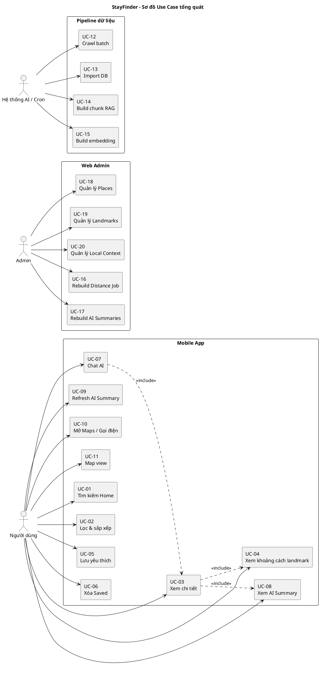

*Hình 1. Sơ đồ Use Case tổng quát*

### ***4.2. Đặc tả Use Case chi tiết***

#### **UC-01: Tìm kiếm chỗ ở từ Home**

| Thuộc tính | Mô tả chi tiết |
| :---- | :---- |
| **Tên Use Case** | Tìm kiếm chỗ ở từ Home (Search from Home) |
| **Mã Use Case** | UC-01 |
| **Tác nhân** | Người dùng cuối |
| **Mô tả** | Cho phép người dùng tìm chỗ ở Đà Nẵng từ màn Home bằng cách nhập từ khóa, chọn quick chip ("gần biển", "gần sân bay", "gia đình", "giá ổn"), hoặc bấm vào thẻ landmark nổi bật. |
| **Tiền điều kiện** | Ứng dụng đã mở; thiết bị có kết nối Internet hoặc đã có dữ liệu cache. |
| **Hậu điều kiện** | App điều hướng sang Results với tham số truy vấn ban đầu; danh sách kết quả được load và hiển thị. |
| **Luồng sự kiện chính** | 1. Người dùng mở app, sau Splash chuyển vào tab Home. 2. App gọi `GET /filters/meta` để lấy thông tin meta (types, districts, amenities, landmarks). 3. App hiển thị thanh tìm kiếm, các quick chip và thẻ landmark nổi bật. 4. Người dùng nhập từ khóa vào ô search (ví dụ: "homestay sông Hàn") rồi bấm "Tìm". 5. App build URL `/results?q=homestay sông Hàn` và push route. 6. Results đọc `q` từ params, gọi `GET /places?q=homestay sông Hàn&limit=20&page=1`. 7. Backend parse query, build SQL động, query Postgres. 8. App nhận response, render danh sách card. |
| **Luồng thay thế** | **A1. Người dùng bấm quick chip "gần biển":** 1. App build query `/results?landmark=my-khe-beach&sort=distance_asc`. 2. Tiếp tục từ bước 6. **A2. Người dùng bấm thẻ landmark Cầu Rồng:** 1. App build `/results?landmark=dragon-bridge`. 2. Tiếp tục từ bước 6. **A3. Người dùng để trống từ khóa và bấm Tìm:** 1. App vẫn điều hướng sang Results nhưng không gắn `q`, trả mặc định 20 kết quả sắp xếp theo rating. |
| **Ngoại lệ** | **E1. Mất kết nối**: Hiển thị banner "Không có kết nối Internet" và nút Retry. **E2. API timeout (>8s)**: Hiển thị error state với thông báo "Yêu cầu quá lâu, vui lòng thử lại". **E3. API trả lỗi 5xx**: Hiển thị error state với message từ backend. |

#### **UC-02: Lọc và sắp xếp kết quả**

| Thuộc tính | Mô tả chi tiết |
| :---- | :---- |
| **Tên Use Case** | Lọc và sắp xếp kết quả (Filter & Sort Results) |
| **Mã Use Case** | UC-02 |
| **Tác nhân** | Người dùng cuối |
| **Mô tả** | Cho phép người dùng thu hẹp kết quả bằng Filter Sheet (loại hình, quận, neighborhood, tiện ích, landmark, rating tối thiểu, khoảng cách tối đa) và đổi cách sắp xếp (rating, reviews, distance, title). |
| **Tiền điều kiện** | Người dùng đang ở Results. App đã có dữ liệu meta filter từ `/filters/meta`. |
| **Hậu điều kiện** | Danh sách Results được làm mới với filter mới; URL/state hiện hành phản ánh filter đang áp dụng. |
| **Luồng sự kiện chính** | 1. Người dùng bấm nút "Bộ lọc" trên Results. 2. App mở `filter-sheet.tsx` dưới dạng modal sheet. 3. Người dùng chọn nhiều type slug (multi-select), nhiều district, nhiều amenity, 1 landmark (kèm distance slider), min_rating slider. 4. Người dùng chọn sort: "rating_desc" / "reviews_desc" / "distance_asc" / "title_asc". 5. Người dùng bấm "Áp dụng". 6. App đóng modal, cập nhật state, gọi `GET /places` với toàn bộ tham số. 7. Backend build SQL: `WHERE type_slug IN (...)`, `AND district IN (...)`, `AND EXISTS (place_amenities ...)`, `AND EXISTS (place_landmark_metrics ... AND distance_m <= maxDistanceM)`, `AND rating >= minRating`. 8. Backend trả kết quả + `total`. 9. App render lại list, hiển thị badge filter đang áp dụng phía trên list. |
| **Luồng thay thế** | **A1. Đặt lại bộ lọc:** Người dùng bấm "Reset" trong Filter Sheet → tất cả filter về mặc định, sort về `rating_desc`. **A2. Đổi sort mà không mở Filter Sheet:** Người dùng bấm dropdown "Sắp xếp theo" ngay trên Results → cập nhật sort, gọi lại API. **A3. Phân trang:** Người dùng scroll xuống cuối list → app gọi `GET /places?...&page=2`, append vào list. |
| **Ngoại lệ** | **E1. Không có kết quả nào khớp filter:** Hiển thị Empty State "Không có kết quả phù hợp" + nút "Đặt lại bộ lọc". **E2. min_rating > max_rating thực tế trong DB:** Backend trả `items: []`, app vẫn render Empty State. **E3. API timeout / lỗi:** Hiển thị error state với nút Retry, filter hiện hành được giữ. |

#### **UC-03: Xem chi tiết địa điểm**

| Thuộc tính | Mô tả chi tiết |
| :---- | :---- |
| **Tên Use Case** | Xem chi tiết địa điểm (View Place Detail) |
| **Mã Use Case** | UC-03 |
| **Tác nhân** | Người dùng cuối |
| **Mô tả** | Cho phép người dùng xem đầy đủ thông tin một địa điểm, bao gồm: ảnh hero + gallery, mô tả, tiện ích, review mẫu, khoảng cách tới landmark, AI Review Summary, các nút action (gọi điện, mở web, mở Maps), nút Lưu vào Saved. |
| **Tiền điều kiện** | Người dùng bấm vào một card ở Home/Results/Chat AI. |
| **Hậu điều kiện** | Màn Place Detail hiển thị đầy đủ dữ liệu của place. AI summary có thể có hoặc chưa, nếu chưa có thì show nút "Tạo tóm tắt AI". |
| **Luồng sự kiện chính** | 1. App điều hướng `/place/[place-id]` với param `place-id`. 2. Detail screen mount, hiển thị skeleton loading. 3. App gọi song song: a. `GET /places/:id` lấy `PlaceDetail` (place core + gallery + amenities + reviews_sample + landmark_metrics + ai_review_summary cached). b. (Tùy chọn) Kiểm tra Saved status từ AsyncStorage. 4. Backend `/places/:id` thực hiện truy vấn tổng hợp: SELECT từ `places`, JOIN/SUBQUERY tới `place_images`, `place_amenities`/`amenities`, top 5 `reviews`, `place_landmark_metrics`, `ai_review_summaries`. 5. App nhận response, render các block: Hero, Header info, Tags, Amenities, Reviews sample, Landmark distance, AI summary, Map mini. 6. Hiển thị nút action: Lưu / Gọi / Web / Maps. |
| **Luồng thay thế** | **A1. Place có cached AI summary:** Render trực tiếp summary text + bullets. **A2. Place chưa có AI summary:** Block AI Summary hiển thị nút "Tạo tóm tắt AI"; khi bấm → kích hoạt UC-08 sinh mới. **A3. Place thiếu ảnh cover hợp lệ:** Hero dùng ảnh fallback brand (`assets/fallback-cover.jpg`). **A4. Place thiếu landmark metrics:** Block khoảng cách hiển thị "Đang cập nhật" thay vì che mất layout. |
| **Ngoại lệ** | **E1. Place không tồn tại (404):** Hiển thị màn "Không tìm thấy địa điểm" + nút quay lại. **E2. Mất kết nối:** Hiển thị error state với nút Retry. **E3. API timeout:** Tương tự E2. **E4. URL ảnh hỏng:** Component `safe-image.tsx` fallback sang ảnh local. |

#### **UC-04: Xem khoảng cách đến landmark**

| Thuộc tính | Mô tả chi tiết |
| :---- | :---- |
| **Tên Use Case** | Xem khoảng cách đến landmark (View Landmark Distance) |
| **Mã Use Case** | UC-04 |
| **Tác nhân** | Người dùng cuối |
| **Mô tả** | Cho phép người dùng xem khoảng cách (mét) từ địa điểm hiện tại tới từng landmark Đà Nẵng đã được precompute. |
| **Tiền điều kiện** | Place có dữ liệu trong `place_landmark_metrics` (đã chạy job rebuild distance). |
| **Hậu điều kiện** | UI hiển thị danh sách landmark + distance + method + anchor_label theo thứ tự tăng dần khoảng cách. |
| **Luồng sự kiện chính** | 1. Trong UC-03, Detail nhận `landmark_metrics` từ response. 2. App format distance: < 1000 m hiển thị `850 m`, ≥ 1000 m hiển thị `2.4 km`. 3. Mỗi landmark hiển thị: tên VN ("Cầu Rồng"), khoảng cách, ghi chú "đường chim bay". 4. Với landmark dạng zone (Sơn Trà, An Thượng), backend đã chọn anchor gần nhất → app hiển thị `anchor_label` (vd. "An Thượng - khu phố Tây trung tâm"). |
| **Luồng thay thế** | **A1. Người dùng lọc theo landmark cụ thể từ Results:** Card list hiển thị `requested_landmark_distance_m` thay vì list nhiều landmark. **A2. Map view:** Marker landmark và marker place hiển thị trên cùng map, có line nối. |
| **Ngoại lệ** | **E1. Place chưa được rebuild distance:** Trả `landmark_metrics: []` → UI hiện "Đang cập nhật khoảng cách". |

#### **UC-05: Lưu địa điểm yêu thích**

| Thuộc tính | Mô tả chi tiết |
| :---- | :---- |
| **Tên Use Case** | Lưu địa điểm yêu thích (Save Place) |
| **Mã Use Case** | UC-05 |
| **Tác nhân** | Người dùng cuối |
| **Mô tả** | Người dùng lưu một địa điểm vào danh sách Saved trên thiết bị (không cần đăng nhập). Dữ liệu Saved được lưu trong AsyncStorage để giữ giữa các phiên. |
| **Tiền điều kiện** | Đang ở Place Detail của một place hợp lệ. |
| **Hậu điều kiện** | Place được thêm vào danh sách Saved local; nút "Lưu" chuyển trạng thái thành "Đã lưu". |
| **Luồng sự kiện chính** | 1. Người dùng bấm nút trái tim "Lưu" ở Place Detail. 2. App đọc danh sách Saved hiện tại từ AsyncStorage key `stayfinder:saved`. 3. App tạo object `SavedPlaceMinimal { place_id, title, cover_image, district, type_slug, savedAt }`. 4. Append vào array nếu chưa có; nếu đã có thì toggle bỏ. 5. Ghi lại vào AsyncStorage. 6. UI cập nhật trạng thái nút. Có haptic feedback nhẹ. |
| **Luồng thay thế** | **A1. Bỏ lưu:** Bấm lần 2 → remove khỏi danh sách. **A2. Lưu từ Chat AI card hoặc Results card (tương lai):** Bấm icon trái tim ngay trên card. |
| **Ngoại lệ** | **E1. AsyncStorage lỗi/quota đầy:** Hiển thị toast "Không thể lưu, vui lòng thử lại". |

#### **UC-06: Xóa địa điểm khỏi Saved**

| Thuộc tính | Mô tả chi tiết |
| :---- | :---- |
| **Tên Use Case** | Xóa địa điểm khỏi Saved (Remove from Saved) |
| **Mã Use Case** | UC-06 |
| **Tác nhân** | Người dùng cuối |
| **Mô tả** | Người dùng xóa nhanh một địa điểm khỏi danh sách Saved bằng cử chỉ vuốt. |
| **Tiền điều kiện** | Có ít nhất một địa điểm trong Saved. |
| **Hậu điều kiện** | Địa điểm bị xóa khỏi danh sách Saved trong AsyncStorage. |
| **Luồng sự kiện chính** | 1. Người dùng mở tab Saved. 2. App đọc list từ AsyncStorage, render FlatList. 3. Người dùng vuốt sang trái trên một row. 4. Animation hiển thị nút "Xóa" màu đỏ. 5. Người dùng bấm "Xóa" (hoặc vuốt đủ xa để auto-confirm). 6. App remove item khỏi state, ghi lại AsyncStorage. 7. Toast "Đã xóa khỏi Saved". |
| **Luồng thay thế** | **A1. Hủy thao tác:** Người dùng vuốt ngược lại → ẩn nút Xóa, không xóa. |
| **Ngoại lệ** | Không có. |

#### **UC-07: Chat AI tư vấn lưu trú**

| Thuộc tính | Mô tả chi tiết |
| :---- | :---- |
| **Tên Use Case** | Chat AI tư vấn lưu trú (Chat AI with RAG) |
| **Mã Use Case** | UC-07 |
| **Tác nhân** | Người dùng cuối |
| **Mô tả** | Người dùng đặt câu hỏi tự nhiên về lưu trú tại Đà Nẵng (vd. *"cho tôi gợi ý nơi ở view đẹp ven sông Hàn"*, *"khách sạn gần Cầu Rồng cho gia đình"*). Hệ thống dùng RAG (SQL filter + semantic retrieval) để trả lời và đính kèm danh sách `recommended_places` có thể bấm vào Detail. |
| **Tiền điều kiện** | Người dùng đang ở tab Chat. Backend AI pipeline đang hoạt động hoặc có fallback structured. |
| **Hậu điều kiện** | Tin nhắn người dùng + tin nhắn AI (text + cards) được render trong khung chat. Lịch sử lưu trong session memory (chưa persist v1). |
| **Luồng sự kiện chính** | 1. Người dùng vào tab Chat. App hiển thị bong bóng chào và 4–6 prompt mẫu (gần biển, gia đình, công tác, ngân sách). 2. Người dùng nhập câu hỏi rồi bấm gửi. 3. App push tin nhắn user lên UI, hiển thị typing indicator. 4. App gọi `POST /chat/query` với body `{ query: "..." }`. 5. Backend nhận request, gọi `scripts/phase2_rag.py query --json ...`. 6. Script Python: a. **Parse intent**: bóc tách `type_slugs`, `landmark_slugs`, `amenity_labels`, `min_rating`, `max_distance_m`, các tín hiệu ngữ cảnh (family/business/beach…). b. **Structured retrieval (SQL)**: query Postgres để lấy candidate list. c. **Semantic retrieval (pgvector)**: encode query → top-k chunk theo cosine. d. **Merge & re-rank**: dedupe theo `place_id`, sắp xếp theo score. e. **Inject local context**: gắn các note từ `local_context_notes` liên quan. f. **Generate answer**: prompt LLM với context = shortlist + facts, yêu cầu chỉ dùng dữ liệu cung cấp. 7. Backend nhận output JSON: `{ answer, recommended_places, applied_filters, local_context_used, follow_up_prompts }`. 8. Backend fetch lại `PlaceSummary` cho từng `place_id` để chuẩn hóa card. 9. Trả response về app. 10. App tắt typing indicator, render bong bóng AI: text + carousel cards + chip follow-up. |
| **Luồng thay thế** | **A1. LLM provider lỗi:** Hệ thống fallback trả `answer` template từ shortlist SQL ("Dưới đây là một số gợi ý phù hợp:"); vẫn có `recommended_places`. **A2. Người dùng bấm card trong chat:** App điều hướng `/place/:place-id`. **A3. Người dùng bấm follow-up:** Câu hỏi follow-up được auto-fill vào ô input, người dùng có thể chỉnh trước khi gửi. **A4. Query không match được gì:** Trả lời gợi ý người dùng nới rộng filter ("Bạn có muốn mở rộng khoảng cách hoặc chấp nhận rating thấp hơn không?"). |
| **Ngoại lệ** | **E1. Query rỗng / chỉ chứa khoảng trắng:** App không cho gửi, nút Send bị disable. **E2. Backend timeout (>30s):** Trả message lỗi thân thiện + nút "Thử lại". **E3. Câu hỏi ngoài domain (vd. "thời tiết đẹp không"):** AI trả lời lịch sự rằng nó chỉ tư vấn lưu trú Đà Nẵng. |

#### **UC-08: Xem tóm tắt review bằng AI**

| Thuộc tính | Mô tả chi tiết |
| :---- | :---- |
| **Tên Use Case** | Xem tóm tắt review bằng AI (View AI Review Summary) |
| **Mã Use Case** | UC-08 |
| **Tác nhân** | Người dùng cuối |
| **Mô tả** | Cho phép người dùng xem nội dung tóm tắt do AI sinh ra dựa trên các review thực tế của địa điểm. Summary gồm 1 đoạn ngắn + 3–5 bullet points (điểm mạnh / điểm yếu / lưu ý). |
| **Tiền điều kiện** | Đang ở Place Detail; place có ít nhất 3 review hoặc đã có cache. |
| **Hậu điều kiện** | UI hiển thị summary_text + bullets. Nếu chưa có cache thì trigger sinh mới. |
| **Luồng sự kiện chính** | 1. Detail mount → block AI Summary đọc `ai_review_summary` từ response của `GET /places/:id`. 2. **Trường hợp có cache**: hiển thị trực tiếp summary_text + bullets + ghi chú "Tóm tắt bởi AI, dựa trên N review". 3. **Trường hợp chưa có cache**: hiển thị nút "Tạo tóm tắt AI". 4. Người dùng bấm nút → app gọi `POST /ai/review-summary` body `{ placeId }`. 5. Backend kiểm tra cache trong `ai_review_summaries`: nếu có và còn hợp lệ → trả luôn. 6. Nếu chưa có → backend chạy script Python: gom review (`stars`, `review_text`, `likes_count`, `published_at`), build prompt, gọi LLM, parse JSON → `{ summary_text, bullets, model, prompt_version, source_review_count, metadata }`. 7. Upsert vào `ai_review_summaries` (UNIQUE theo `place_id`). 8. Trả response cho app. 9. App render summary trong block. |
| **Luồng thay thế** | **A1. Mở rộng AI Summary:** Người dùng bấm "Xem chi tiết AI" → mở `/ai-review/[place-id]` để xem layout đầy đủ + có nút Refresh. **A2. AI chưa tạo được (review quá ít):** Hiển thị "Chưa đủ dữ liệu để tóm tắt" + đề nghị quay lại sau. |
| **Ngoại lệ** | **E1. LLM timeout (>45s):** Hiển thị error state, không ghi cache; cho user thử lại. **E2. Lỗi parse JSON từ LLM:** Backend bỏ qua không cache, trả error có message. |

#### **UC-09: Tạo lại tóm tắt review (refresh)**

| Thuộc tính | Mô tả chi tiết |
| :---- | :---- |
| **Tên Use Case** | Tạo lại tóm tắt review (Refresh AI Summary) |
| **Mã Use Case** | UC-09 |
| **Tác nhân** | Người dùng cuối |
| **Mô tả** | Cho phép người dùng yêu cầu hệ thống sinh lại tóm tắt AI khi cảm thấy tóm tắt cũ chưa cập nhật hoặc place đã có thêm review mới. |
| **Tiền điều kiện** | Có cache AI summary cũ. |
| **Hậu điều kiện** | Cache cũ bị thay thế bởi summary mới với metadata model/prompt_version mới. |
| **Luồng sự kiện chính** | 1. Người dùng vào `/ai-review/[place-id]`. 2. Bấm nút "Tạo lại tóm tắt". 3. App gọi `POST /ai/review-summary` với `{ placeId, refresh: true, useLlm: true }`. 4. Backend bỏ qua cache, gọi lại pipeline tóm tắt như UC-08. 5. Upsert đè cache. 6. App nhận response, fade-in nội dung mới. |
| **Luồng thay thế** | Không có. |
| **Ngoại lệ** | Tương tự UC-08 (E1, E2). |

#### **UC-10: Mở Google Maps / Gọi điện**

| Thuộc tính | Mô tả chi tiết |
| :---- | :---- |
| **Tên Use Case** | Mở Google Maps / Gọi điện (Open Maps / Phone Call) |
| **Mã Use Case** | UC-10 |
| **Tác nhân** | Người dùng cuối |
| **Mô tả** | Người dùng chuyển từ Place Detail sang ứng dụng bản đồ hoặc thực hiện cuộc gọi đến số điện thoại của địa điểm. |
| **Tiền điều kiện** | Place có `lat/lng` (cho Maps) hoặc `phone` (cho gọi điện). |
| **Hậu điều kiện** | App hệ điều hành (Maps / Phone) được mở qua deep link. |
| **Luồng sự kiện chính** | 1. Người dùng bấm "Mở Google Maps" → app gọi `Linking.openURL('https://www.google.com/maps/search/?api=1&query=lat,lng')`. 2. Người dùng bấm "Gọi điện" → app gọi `Linking.openURL('tel:+84xxxxxxxxx')`. 3. Hệ điều hành chuyển sang app tương ứng. |
| **Luồng thay thế** | **A1. Mở website:** Bấm "Mở website" → `Linking.openURL(website)`. |
| **Ngoại lệ** | **E1. Không có `phone`:** Nút "Gọi điện" bị disable. **E2. Không có `lat/lng`:** Nút "Mở Maps" bị disable. |

#### **UC-11: Xem map view kết quả**

| Thuộc tính | Mô tả chi tiết |
| :---- | :---- |
| **Tên Use Case** | Xem map view kết quả (View Map View) |
| **Mã Use Case** | UC-11 |
| **Tác nhân** | Người dùng cuối |
| **Mô tả** | Cho phép người dùng xem các địa điểm hiện hành ở dạng marker trên bản đồ, đồng bộ với card list. |
| **Tiền điều kiện** | Đang ở Results hoặc Detail. |
| **Hậu điều kiện** | Bản đồ hiển thị marker + cluster theo zoom level. |
| **Luồng sự kiện chính** | 1. Người dùng bấm icon "Bản đồ" trên Results. 2. App gọi `GET /places/map?...` để lấy danh sách marker (chỉ `id, place_id, title, lat, lng, type_slug, rating, cover_image`). 3. App render map với cluster. 4. Bấm marker → bottom card preview → bấm Detail. |
| **Luồng thay thế** | **A1. Focus theo landmark:** Khi filter chứa landmark → map auto-zoom tới khu vực landmark. |
| **Ngoại lệ** | **E1. Marker quá nhiều > 500:** Backend giới hạn `limit` mặc định 500; app hiển thị thông báo "Hãy lọc thêm để map hiển thị chính xác". |

#### **UC-12: Crawl dữ liệu theo batch**

| Thuộc tính | Mô tả chi tiết |
| :---- | :---- |
| **Tên Use Case** | Crawl dữ liệu theo batch (Crawl Batch) |
| **Mã Use Case** | UC-12 |
| **Tác nhân** | Admin / Hệ thống crawler |
| **Mô tả** | Chạy crawler Apify để thu thập dữ liệu chỗ ở Đà Nẵng, sinh đồng thời file raw (audit) và compact (cho app/API). |
| **Tiền điều kiện** | `APIFY_TOKEN` được cấu hình; có dung lượng đĩa trống ở `output/`. |
| **Hậu điều kiện** | Có thư mục `output/danang_accommodations_batch_<TIMESTAMP>/` chứa `all_types_raw_combined.json` và `all_types_compact_combined.json`. |
| **Luồng sự kiện chính** | 1. Admin chạy `python scripts/apify_danang_accommodations_batch.py`. 2. Script đọc cấu hình input (city, types, maxItems), build batch_key = `danang_accommodations_batch_<TS>`. 3. Gọi Apify Google Maps Crawler Actor. 4. Nhận output, tách thành 2 dataset: raw (giữ nguyên), compact (chỉ giữ trường cần thiết). 5. Ghi vào `output/<batch_key>/`. |
| **Luồng thay thế** | **A1. Crawl demo nhỏ**: chạy `apify_google_maps_demo.py` để thử pipeline. |
| **Ngoại lệ** | **E1. Token sai/hết hạn:** Script báo lỗi 401. **E2. Mạng lỗi:** Apify auto-retry; nếu vẫn lỗi → ghi log và exit code != 0. |

#### **UC-13: Import dataset vào Postgres**

| Thuộc tính | Mô tả chi tiết |
| :---- | :---- |
| **Tên Use Case** | Import dataset vào Postgres (Import Compact to DB) |
| **Mã Use Case** | UC-13 |
| **Tác nhân** | Admin |
| **Mô tả** | Import compact JSON dataset vào DB Postgres, idempotent theo `place_id`. |
| **Tiền điều kiện** | DB đã chạy migration; có connection string trong `.env`; có file `all_types_compact_combined.json`. |
| **Hậu điều kiện** | Các bảng `crawl_batches`, `places`, `place_images`, `reviews`, `amenities`, `place_amenities` được upsert đầy đủ. |
| **Luồng sự kiện chính** | 1. Admin chạy `python scripts/import_compact_to_supabase.py <compact.json> --batch-key <batch_key>`. 2. Script upsert vào `crawl_batches` (insert nếu chưa có, update `row_count`, `source_path`). 3. Lặp qua từng place trong file, upsert vào `places` theo `UNIQUE place_id`. 4. Đồng bộ `place_images` (delete cũ → insert mới theo `sort_order`). 5. Đồng bộ `reviews` (UNIQUE theo `place_id + source_review_id`). 6. Upsert dimension `amenities` (UNIQUE slug, label). 7. Đồng bộ `place_amenities` (replace tập amenity hiện hành). 8. Log số lượng inserted/updated/skipped. |
| **Luồng thay thế** | **A1. Chạy lại cùng batch:** Không tạo trùng. `place_id` đã có → update. **A2. Import batch mới:** Tạo `crawl_batches` mới, places được gán `batch_id` mới. |
| **Ngoại lệ** | **E1. Connection lỗi:** Script báo lỗi và thoát. **E2. JSON sai schema:** Script validate trước khi insert, log lỗi từng record. |

#### **UC-14: Build chunk RAG**

| Thuộc tính | Mô tả chi tiết |
| :---- | :---- |
| **Tên Use Case** | Build chunk RAG (Build RAG Chunks) |
| **Mã Use Case** | UC-14 |
| **Tác nhân** | Admin / Hệ thống AI |
| **Mô tả** | Tạo các chunk văn bản (1 hoặc nhiều chunk/place) phục vụ semantic retrieval. |
| **Tiền điều kiện** | Bảng `places`, `place_amenities`, `reviews`, `place_landmark_metrics`, `local_context_notes` đã có dữ liệu. |
| **Hậu điều kiện** | Bảng `ai_place_chunks` chứa các chunk với `content`, `content_md5`, `metadata`, `chunk_index`. |
| **Luồng sự kiện chính** | 1. Admin chạy `python scripts/phase2_rag.py chunk --batch-key <batch_key>`. 2. Script duyệt từng place trong batch. 3. Compose văn bản chunk từ: title, type_label, address/neighborhood, rating, reviews_count, top amenity labels, review cues (3 review tiêu biểu), landmark distance phrases ("cách Cầu Rồng 1.2 km"), local context notes. 4. Cắt thành chunk theo độ dài (~800–1200 ký tự). 5. Tính `content_md5` để dedupe khi chạy lại. 6. Upsert vào `ai_place_chunks` theo `UNIQUE (place_id, chunk_index)`. |
| **Luồng thay thế** | **A1. Rebuild theo place:** `--place-id ...`. **A2. Force rebuild bỏ qua md5:** `--force`. |
| **Ngoại lệ** | **E1. Place không có dữ liệu giàu:** Tạo chunk tối thiểu từ title + type + district để không miss. |

#### **UC-15: Build embedding**

| Thuộc tính | Mô tả chi tiết |
| :---- | :---- |
| **Tên Use Case** | Build embedding (Build Vector Embeddings) |
| **Mã Use Case** | UC-15 |
| **Tác nhân** | Admin / Hệ thống AI |
| **Mô tả** | Tính vector 1536-dim cho từng chunk, ghi vào `ai_place_chunks.embedding`. |
| **Tiền điều kiện** | UC-14 đã hoàn tất; có API key cho provider embedding (OpenAI-compatible). |
| **Hậu điều kiện** | Mọi chunk có embedding hợp lệ; HNSW/IVF index hoạt động. |
| **Luồng sự kiện chính** | 1. Admin chạy `python scripts/phase2_rag.py embed --batch-key <batch_key>`. 2. Script lấy các chunk chưa có embedding hoặc đã có nhưng `content_md5` đổi. 3. Gọi embeddings endpoint theo batch (mỗi batch 16–32 chunk). 4. Insert/Update cột `embedding`. 5. Log progress, rate-limit và retry tự động. |
| **Luồng thay thế** | **A1. Reembed force:** `--force`. |
| **Ngoại lệ** | **E1. Rate limit:** Backoff exponential. **E2. API down:** Script dừng có log để admin chạy lại sau. |

#### **UC-16: Rebuild khoảng cách landmark**

| Thuộc tính | Mô tả chi tiết |
| :---- | :---- |
| **Tên Use Case** | Rebuild khoảng cách landmark (Rebuild Distance Metrics) |
| **Mã Use Case** | UC-16 |
| **Tác nhân** | Admin |
| **Mô tả** | Tính lại khoảng cách Haversine giữa từng place và từng landmark đã đăng ký. Với landmark dạng zone (Sơn Trà, An Thượng), chọn anchor gần nhất. |
| **Tiền điều kiện** | Place có `lat/lng`; landmark có `lat/lng` (hoặc multi-anchor metadata). |
| **Hậu điều kiện** | `place_landmark_metrics` cập nhật, có `walking_distance_m`, `source = 'haversine'`. |
| **Luồng sự kiện chính** | 1. Admin gọi `POST /admin/jobs/distance/rebuild` (Bearer admin token). 2. Backend ghi `job_id`, trả ngay nếu chạy nền. 3. Backend gọi SQL function `refresh_place_landmark_metrics(batch_key text DEFAULT NULL, place_ids text[] DEFAULT NULL)`. 4. SQL function loop qua từng cặp (place, landmark), tính Haversine, upsert vào `place_landmark_metrics`. 5. Trả tổng số bản ghi đã update. |
| **Luồng thay thế** | **A1. `{"wait": true}`:** Request block đến khi job xong, trả số liệu trực tiếp. |
| **Ngoại lệ** | **E1. Place thiếu lat/lng:** Bỏ qua, log warning. |

#### **UC-17: Rebuild AI review summaries**

| Thuộc tính | Mô tả chi tiết |
| :---- | :---- |
| **Tên Use Case** | Rebuild AI review summaries |
| **Mã Use Case** | UC-17 |
| **Tác nhân** | Admin |
| **Mô tả** | Sinh lại tóm tắt AI cho 1 hoặc nhiều place theo `batchKey` hoặc `placeIds`. |
| **Tiền điều kiện** | Có review trong DB; LLM provider hoạt động. |
| **Hậu điều kiện** | `ai_review_summaries` được upsert; `prompt_version` cập nhật. |
| **Luồng sự kiện chính** | 1. Admin gọi `POST /admin/jobs/review-summaries/rebuild` với body `{ batchKey?, placeIds?[] , force?: bool }`. 2. Backend tạo `job_id`, chạy nền `scripts/pregenerate_review_summaries.mjs` hoặc `phase2_rag.py review-summary`. 3. Script duyệt từng place, áp logic UC-08. 4. Upsert vào `ai_review_summaries`. |
| **Luồng thay thế** | **A1. Chỉ sinh cho place chưa có cache:** mặc định không `force`. |
| **Ngoại lệ** | **E1. Place không đủ review:** Skip, log. |

#### **UC-18: Quản lý places (Web admin)**

| Thuộc tính | Mô tả chi tiết |
| :---- | :---- |
| **Tên Use Case** | Quản lý places (Web admin) |
| **Mã Use Case** | UC-18 |
| **Tác nhân** | Admin |
| **Mô tả** | Admin CRUD place qua web admin. Mục đích chính là sửa thông tin sai (ví dụ: chuẩn lại tên, gán `district` đúng) chứ không phải thay thế pipeline crawl. |
| **Tiền điều kiện** | Admin đã đăng nhập web admin, có token. |
| **Hậu điều kiện** | Bảng `places` được cập nhật; nếu sửa `lat/lng` thì cần rebuild distance (UC-16). |
| **Luồng sự kiện chính** | 1. Admin mở list places. 2. Lọc theo type/district/quality flag. 3. Bấm sửa → form hiện các field có thể chỉnh: `title`, `type_slug`, `district`, `neighborhood`, `phone`, `website`, `lat`, `lng`. 4. Bấm Lưu → `PATCH /admin/places/:id` với body chỉ các field thay đổi. 5. Backend update. |
| **Luồng thay thế** | **A1. Xóa mềm:** `DELETE /admin/places/:id` → set flag, không xóa cứng. |
| **Ngoại lệ** | **E1. Conflict (updated_at đã đổi):** Báo lỗi 409. |

#### **UC-19: Quản lý landmarks (Web admin)**

| Thuộc tính | Mô tả chi tiết |
| :---- | :---- |
| **Tên Use Case** | Quản lý landmarks |
| **Mã Use Case** | UC-19 |
| **Tác nhân** | Admin |
| **Mô tả** | Admin tạo/sửa/xóa landmark. Hỗ trợ landmark dạng `point` (1 toạ độ) và `zone_ref` (nhiều anchor trong metadata). |
| **Tiền điều kiện** | Admin đã đăng nhập. |
| **Hậu điều kiện** | `local_landmarks` cập nhật. Sau khi sửa, nên chạy UC-16. |
| **Luồng sự kiện chính** | 1. Admin mở list landmarks. 2. Bấm "Tạo mới" → nhập `slug`, `name`, `kind (point|zone_ref)`, `lat`, `lng`, `metadata` (nếu zone). 3. Bấm Lưu → `POST /admin/landmarks`. 4. Backend insert. |
| **Luồng thay thế** | Tương tự UC-18. |
| **Ngoại lệ** | **E1. Slug trùng:** Backend trả 409. |

#### **UC-20: Quản lý local context notes**

| Thuộc tính | Mô tả chi tiết |
| :---- | :---- |
| **Tên Use Case** | Quản lý local context notes |
| **Mã Use Case** | UC-20 |
| **Tác nhân** | Admin |
| **Mô tả** | Admin CRUD các ghi chú văn bản về khu vực ("phố Tây An Thượng", "gần biển", "gần trung tâm", "gần sân bay"). Chỉ giữ fact có thể kiểm chứng. |
| **Tiền điều kiện** | Admin đã đăng nhập. |
| **Hậu điều kiện** | Sau khi sửa, nên chạy UC-14 + UC-15 lại để chunk/embedding cập nhật. |
| **Luồng sự kiện chính** | 1. Admin mở list notes. 2. Bấm sửa/tạo → nhập `slug`, `title`, `content_md`, `tags`, `applies_to` (district/landmark/type). 3. Bấm Lưu → `POST/PATCH /admin/local-context-notes`. |
| **Luồng thay thế** | **A1. Bulk import:** Upload JSON file. |
| **Ngoại lệ** | Không có. |

## **5. Ma trận truy vết yêu cầu (Requirement Traceability Matrix)**

| Mã yêu cầu | Mô tả ngắn | Use Case liên quan | Module / Endpoint | Bảng dữ liệu |
| :---- | :---- | :---- | :---- | :---- |
| BR-1, FR-1, FR-2, FR-3 | Tìm + Lọc + Sắp xếp | UC-01, UC-02 | Home, Results, Filter Sheet; `GET /places`, `GET /filters/meta` | `places`, `amenities`, `place_amenities` |
| BR-2, FR-12 | So sánh trên map | UC-11 | Map view; `GET /places/map` | `places`, `place_landmark_metrics` |
| BR-3, FR-5, FR-6 | Tóm tắt review AI | UC-03, UC-08, UC-09 | Detail, AI Summary; `POST /ai/review-summary` | `reviews`, `ai_review_summaries` |
| BR-4, FR-9, FR-10 | Chat AI tư vấn | UC-07 | Chat tab; `POST /chat/query` | `ai_place_chunks`, `local_context_notes` |
| BR-5, FR-7, FR-8 | Lưu / quản lý Saved | UC-05, UC-06 | Saved tab, AsyncStorage | (local) |
| BR-6, FR-17, FR-18, FR-19, FR-20 | Pipeline dữ liệu idempotent | UC-12, UC-13, UC-14, UC-15 | scripts/`apify_*`, `import_*`, `phase2_rag.py` | `crawl_batches`, `places`, `ai_place_chunks` |
| BR-7, FR-16 | Admin job rebuild | UC-16, UC-17 | `POST /admin/jobs/distance|chunks|embeddings|review-summaries/rebuild` | `place_landmark_metrics`, `ai_*` |
| BR-8 | AI có truy vết | UC-07, UC-08 | RAG pipeline + metadata `prompt_version, model, source_review_count` | `ai_place_chunks`, `ai_review_summaries` |
| BR-9, NFR-6 | Không lộ dữ liệu reviewer | tất cả endpoint public | view/serializer trong `src/server.js` | `reviews.payload` (raw) |
| BR-10, NFR-7 | Admin auth | UC-13..UC-20 | middleware admin trong `src/server.js` | (env) `ADMIN_API_TOKEN` |

## **6. Phân tích rủi ro**

| Rủi ro | Tác động | Phương án giảm thiểu |
| :---- | :---- | :---- |
| Dữ liệu crawl thiếu trường quan trọng (lat/lng, phone) | Sai lệch detail và filter khoảng cách | Chuẩn hóa fallback ở stage compact + flag `needs_review` ở batch |
| URL ảnh từ Google không hiển thị được | UI vỡ, mất niềm tin | Backend lọc ảnh có marker xấu; mobile dùng `safe-image` fallback |
| Place trùng giữa nhiều batch | Inflated count | UNIQUE `place_id` + upsert idempotent |
| LLM provider gián đoạn / hết quota | Chat AI / Summary không trả lời | Fallback structured answer; queue retry |
| Embedding model thay đổi → vector cũ lệch | Semantic kém chính xác | Lưu `model` và `prompt_version`, có thể rebuild theo batch |
| Người dùng đặt câu hỏi ngoài Đà Nẵng | Trả lời sai miền | Intent parser + system prompt khoanh vùng "Đà Nẵng v1" |
| RLS sai cấu hình → lộ dữ liệu private | Bảo mật | Public-read trên các bảng dùng cho app; service role chỉ ở backend |
| Mobile chạy chậm khi nhiều ảnh | UX kém | Dùng `expo-image` + sort_order; lazy load gallery |
| Mất batch_key gốc | Không truy vết được | Bảng `crawl_batches` luôn lưu source_path |
| Người dùng app chưa có data offline | App "trống" | Cache GET /places và /filters/meta tối thiểu trong AsyncStorage |

---

## **II. THIẾT KẾ HỆ THỐNG**

## **1. Kiến trúc hệ thống**

### ***1.1. Mô hình tổng thể (Client-Server với BaaS-like)***

StayFinder sử dụng **kiến trúc client–server 4 lớp**, trong đó tầng dữ liệu là PostgreSQL có quản lý (Supabase), tầng API là Node.js + Express, và có thêm **AI Pipeline layer** chuyên biệt cho RAG.

> **Nguồn PlantUML:** `docs/bao-cao-plantuml/fig02-system-context.puml` — dán toàn bộ khối dưới vào [PlantUML Online](https://www.plantuml.com/plantuml/uml/).

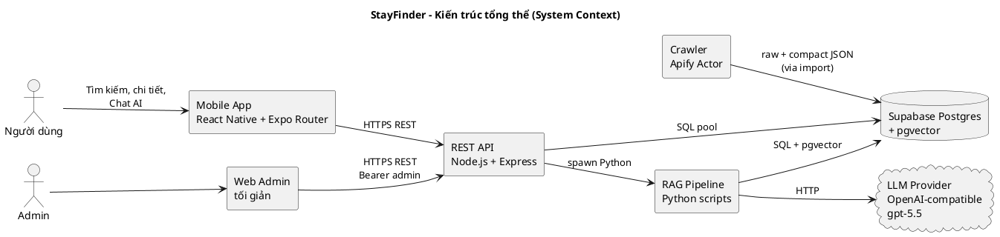

*Hình 2. Sơ đồ kiến trúc tổng thể (System Context)*

**Đặc điểm kiến trúc**

- **Phân tách rõ ràng theo trách nhiệm**: Mobile (UI/UX), API (BFF), DB (data + vector), RAG (AI intelligence).
- **AI là service tách biệt** chứ không nhồi vào API: gọi Python script qua `child_process.spawn` để dễ thay LLM provider.
- **Không có session login** cho người dùng app → kiến trúc đơn giản hóa.
- **Admin tách auth** bằng Bearer token, không dùng cùng cơ chế với user.
- **Idempotent data pipeline**: crawl → compact → import có thể chạy lại nhiều lần không sinh duplicate.

### ***1.2. Kiến trúc theo Container (C4 Container Level)***

> **Nguồn PlantUML:** `docs/bao-cao-plantuml/fig03-container.puml` — dán toàn bộ khối dưới vào [PlantUML Online](https://www.plantuml.com/plantuml/uml/).

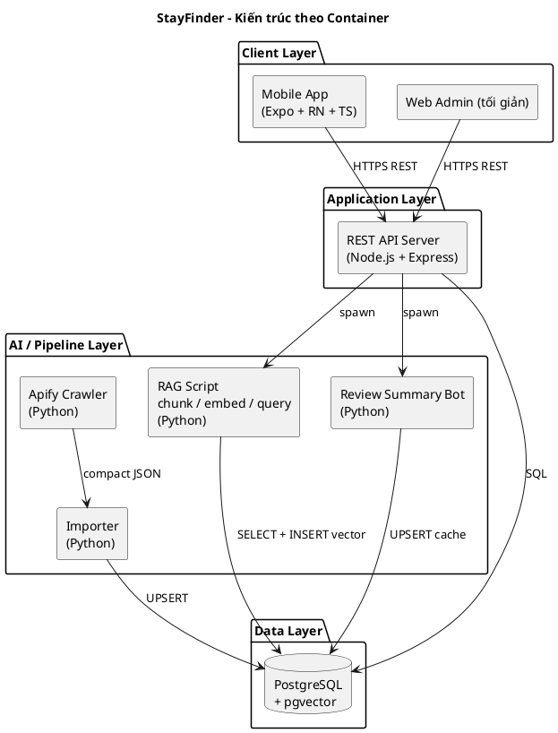

*Hình 3. Sơ đồ kiến trúc theo Container*

### ***1.3. Kiến trúc bên trong Mobile App***

Mobile app được tổ chức theo mô hình 3 lớp:

> **Nguồn PlantUML:** `docs/bao-cao-plantuml/fig04-mobile-architecture.puml` — dán toàn bộ khối dưới vào [PlantUML Online](https://www.plantuml.com/plantuml/uml/).

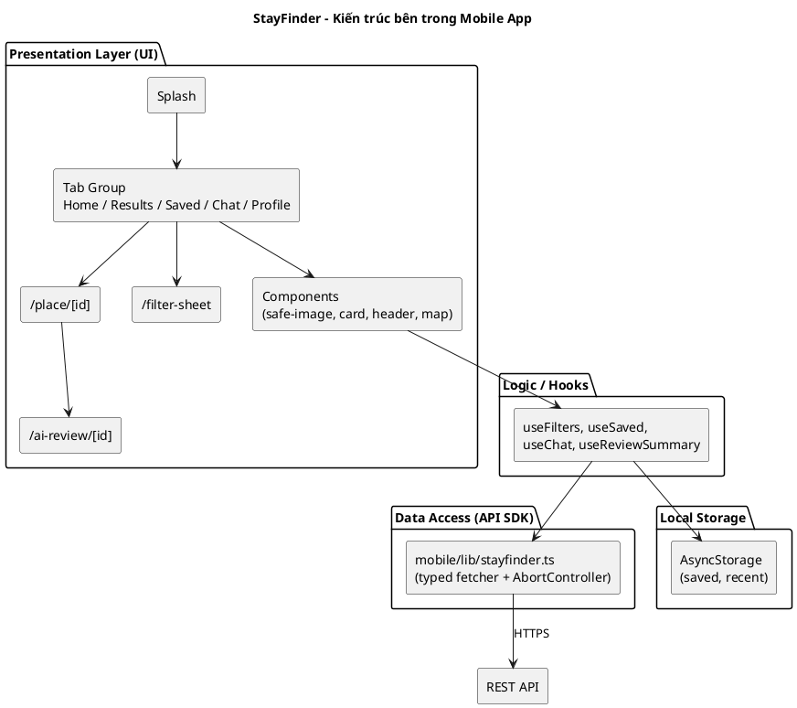

*Hình 4. Sơ đồ kiến trúc bên trong Mobile App*

### ***1.4. Kiến trúc Backend API + RAG Pipeline***

> **Nguồn PlantUML:** `docs/bao-cao-plantuml/fig05-backend-rag.puml` — dán toàn bộ khối dưới vào [PlantUML Online](https://www.plantuml.com/plantuml/uml/).

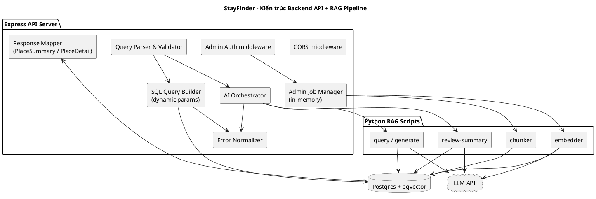

*Hình 5. Sơ đồ kiến trúc Backend API + RAG Pipeline*

## **2. Thiết kế Cơ sở dữ liệu (PostgreSQL Schema)**

StayFinder sử dụng PostgreSQL 15 (managed bởi Supabase). Schema được chia thành 4 cụm chức năng:

1. **Cụm Batch/Audit**: `crawl_batches`.
2. **Cụm Listing**: `places`, `place_images`, `reviews`.
3. **Cụm Amenity / N-N**: `amenities`, `place_amenities`.
4. **Cụm Local Context**: `local_landmarks`, `local_zones`, `place_landmark_metrics`, `local_context_notes`.
5. **Cụm AI/RAG**: `ai_place_chunks`, `ai_review_summaries`.

### ***2.1. Sơ đồ ERD tổng quát***

> **Nguồn PlantUML:** `docs/bao-cao-plantuml/fig06-erd.puml` — dán toàn bộ khối dưới vào [PlantUML Online](https://www.plantuml.com/plantuml/uml/).

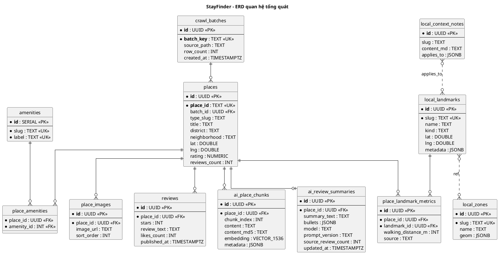

*Hình 6. Sơ đồ ERD quan hệ tổng quát các bảng*

### ***2.2. Bảng `crawl_batches`***

Lưu metadata mỗi đợt crawl/import.

| Thuộc tính | Kiểu | Mô tả |
| :---- | :---- | :---- |
| `id` | uuid PK | Khóa chính sinh tự động |
| `batch_key` | text UK | Mã batch duy nhất, vd. `danang_accommodations_batch_20260323_082743` |
| `source_path` | text | Đường dẫn file compact đã import |
| `notes` | text | Ghi chú admin |
| `row_count` | integer | Số bản ghi place trong batch |
| `created_at` | timestamptz | Thời điểm tạo |

### ***2.3. Bảng `places` (trung tâm)***

| Thuộc tính | Kiểu | Mô tả |
| :---- | :---- | :---- |
| `id` | uuid PK | Khóa nội bộ |
| `place_id` | text UK | Khóa nghiệp vụ duy nhất (Google place_id) |
| `batch_id` | uuid FK | → `crawl_batches.id` |
| `type_slug` | text | `hotel`, `homestay`, `nha-nghi`, `apart-hotel`,… |
| `type_label` | text | Nhãn hiển thị (vd. "Khách sạn") |
| `title` | text | Tên địa điểm |
| `description` | text | Mô tả ngắn |
| `address`, `neighborhood`, `district`, `street`, `city`, `postal_code` | text | Địa chỉ |
| `phone`, `website` | text | Liên hệ |
| `lat`, `lng` | double precision | Tọa độ |
| `rating` | numeric(4,2) | Điểm đánh giá |
| `reviews_count` | integer | Tổng review |
| `images_count` | integer | Tổng ảnh |
| `price_text` | text | Giá hiển thị nguyên dạng |
| `hotel_stars` | integer | Sao (nếu hotel) |
| `categories` | text[] | Tag thể loại |
| `crawl_search_terms` | text[] | Từ khóa crawl ra place này |
| `raw_payload` | jsonb | Toàn bộ data nguồn để audit (không expose public) |
| `created_at`, `updated_at` | timestamptz | Thời gian |

**Index quan trọng**

- `idx_places_type_slug`, `idx_places_district`, `idx_places_neighborhood`, `idx_places_rating`, `idx_places_reviews_count`, `idx_places_lat_lng`.

**Trigger**

- `trg_places_updated_at`: tự cập nhật `updated_at` mỗi lần UPDATE.

### ***2.4. Bảng `place_images`***

| Thuộc tính | Kiểu | Mô tả |
| :---- | :---- | :---- |
| `id` | uuid PK | |
| `place_id` | uuid FK → `places.id` | |
| `image_url` | text | URL ảnh đã filter (không có marker xấu) |
| `sort_order` | integer | Thứ tự ưu tiên hiển thị (0 = cover) |

### ***2.5. Bảng `reviews`***

| Thuộc tính | Kiểu | Mô tả |
| :---- | :---- | :---- |
| `id` | uuid PK | |
| `place_id` | uuid FK → `places.id` | |
| `source_review_id` | text | ID review từ nguồn (Google) |
| `stars` | integer | 1–5 |
| `review_text` | text | Nội dung gốc |
| `text_translated` | text | Bản dịch nếu có |
| `published_at` | timestamptz | Ngày đăng |
| `likes_count` | integer | Lượt thích trên Google Maps |
| `review_origin` | text | Nguồn review |
| `payload` | jsonb | Dữ liệu reviewer chi tiết (không expose) |
| `created_at` | timestamptz | |

**UNIQUE INDEX**: `(place_id, source_review_id)` khi `source_review_id` không null.

### ***2.6. Bảng `amenities` & `place_amenities`***

`amenities` là dimension table, `place_amenities` là bảng N-N.

| Bảng | Thuộc tính | Kiểu | Mô tả |
| :---- | :---- | :---- | :---- |
| `amenities` | `id` | serial PK | |
| | `slug` | text UK | `wifi`, `swimming-pool`, `family-room` |
| | `label` | text UK | "Wifi miễn phí", "Hồ bơi", "Phòng gia đình" |
| `place_amenities` | `place_id` | uuid FK | |
| | `amenity_id` | int FK | |

### ***2.7. Bảng `local_landmarks` & `local_zones`***

| Bảng | Thuộc tính | Kiểu | Mô tả |
| :---- | :---- | :---- | :---- |
| `local_landmarks` | `id` | uuid PK | |
| | `slug` | text UK | `dragon-bridge`, `han-bridge`, `my-khe-beach`,… |
| | `name` | text | "Cầu Rồng", "Cầu Sông Hàn", "Biển Mỹ Khê",… |
| | `kind` | text | `point` hoặc `zone_ref` |
| | `lat`, `lng` | double precision | Áp dụng cho `point` |
| | `metadata` | jsonb | Với zone: chứa danh sách `anchors[]` với `lat`, `lng`, `label` |
| `local_zones` | `slug`, `name`, `description`, `geom (jsonb)`, `metadata` | | GeoJSON polygon (chuẩn bị mở rộng) |

### ***2.8. Bảng `place_landmark_metrics`***

| Thuộc tính | Kiểu | Mô tả |
| :---- | :---- | :---- |
| `id` | uuid PK | |
| `place_id` | uuid FK | |
| `landmark_id` | uuid FK | |
| `walking_distance_m` | integer | Khoảng cách đường chim bay (Haversine) |
| `walking_duration_s` | integer | Tham khảo (đường chim bay) |
| `driving_distance_m` | integer | Để mở rộng OSRM về sau |
| `driving_duration_s` | integer | |
| `source` | text | `'haversine'` mặc định cho v1 |
| `computed_at` | timestamptz | |
| | UNIQUE | `(place_id, landmark_id)` |

### ***2.9. Bảng `local_context_notes`***

Lưu các fact ngữ cảnh có thể tái sử dụng cho RAG.

| Thuộc tính | Kiểu | Mô tả |
| :---- | :---- | :---- |
| `id` | uuid PK | |
| `slug` | text | `an-thuong-foreigner-street`,… |
| `title` | text | Tiêu đề |
| `content_md` | text | Nội dung markdown ngắn |
| `tags` | text[] | `["family", "central", "beach"]` |
| `applies_to` | jsonb | `{ "districts": [...], "landmarks": [...], "type_slugs": [...] }` |
| `created_at`, `updated_at` | timestamptz | |

### ***2.10. Bảng `ai_place_chunks` (RAG core)***

| Thuộc tính | Kiểu | Mô tả |
| :---- | :---- | :---- |
| `id` | uuid PK | |
| `place_id` | uuid FK | |
| `chunk_index` | integer | 0, 1, 2,… |
| `content` | text | Văn bản chunk |
| `content_md5` | text | Hash để dedupe |
| `metadata` | jsonb | `{ batch_key, type_slug, district, tags[] }` |
| `embedding` | vector(1536) | pgvector embedding |
| `created_at` | timestamptz | |
| | UNIQUE | `(place_id, chunk_index)` |

**Index**: HNSW/IVF cosine trên `embedding` (tạo riêng khi đủ dữ liệu).

### ***2.11. Bảng `ai_review_summaries`***

| Thuộc tính | Kiểu | Mô tả |
| :---- | :---- | :---- |
| `id` | uuid PK | |
| `place_id` | uuid FK UK | (1:1 với place) |
| `summary_text` | text | Đoạn tóm tắt ngắn |
| `bullets` | jsonb | Mảng bullet point |
| `model` | text | vd. `gpt-5.5` |
| `prompt_version` | text | vd. `v1.2` |
| `source_review_count` | integer | Số review dùng để sinh |
| `metadata` | jsonb | Thông tin truy vết khác |
| `updated_at` | timestamptz | |

### ***2.12. Chiến lược index***

- **Filter cứng**: `places (type_slug)`, `places (district)`, `places (neighborhood)`, `places (rating)`, `places (reviews_count)`, `places (lat, lng)`.
- **Distance**: `place_landmark_metrics (place_id)`, `place_landmark_metrics (landmark_id)`, composite `(landmark_id, walking_distance_m)`.
- **Vector**: HNSW cosine trên `ai_place_chunks.embedding`.
- **Lookup detail**: `places.place_id` đã UNIQUE → O(1).

### ***2.13. Row Level Security***

Bật RLS trên 10 bảng dữ liệu chính, tạo policy `SELECT USING (true)` cho **public-read**. Service role (dùng trong backend) bypass RLS để thực hiện UPDATE/INSERT/DELETE.

## **3. Thiết kế API (REST Contract)**

### ***3.1. Bảng tổng hợp các endpoint***

| Phương thức | Path | Mô tả | Auth |
| :---- | :---- | :---- | :---: |
| GET | `/health` | Kiểm tra liveness | – |
| GET | `/places` | Tìm + lọc + sắp xếp danh sách place | – |
| GET | `/places/:id` | Chi tiết một place | – |
| GET | `/places/map` | Marker cho map view | – |
| GET | `/filters/meta` | Danh sách filter options | – |
| GET | `/landmarks` | Danh sách landmark | – |
| POST | `/chat/query` | Chat AI tư vấn (RAG) | – |
| POST | `/ai/review-summary` | Tóm tắt review AI | – |
| GET/POST/PATCH/DELETE | `/admin/places` | CRUD place | Bearer |
| GET/POST/PATCH/DELETE | `/admin/landmarks` | CRUD landmark | Bearer |
| GET/POST/PATCH/DELETE | `/admin/local-context-notes` | CRUD note | Bearer |
| GET | `/admin/jobs`, `/admin/jobs/:id` | Theo dõi job | Bearer |
| POST | `/admin/jobs/distance/rebuild` | Rebuild Haversine distance | Bearer |
| POST | `/admin/jobs/chunks/rebuild` | Rebuild chunk | Bearer |
| POST | `/admin/jobs/embeddings/rebuild` | Rebuild embedding | Bearer |
| POST | `/admin/jobs/review-summaries/rebuild` | Rebuild AI summaries | Bearer |

### ***3.2. Hợp đồng `GET /places`***

**Query parameters**

| Tham số | Kiểu | Mô tả |
| :---- | :---- | :---- |
| `q` | string | Từ khóa |
| `type` | string[] (multi) | Lọc theo type_slug |
| `district` | string[] | Lọc theo quận |
| `neighborhood` | string[] | Lọc theo neighborhood |
| `amenity` | string[] | Lọc theo amenity label |
| `landmark` | string[] | Lọc theo landmark slug |
| `min_rating` | number | Rating tối thiểu |
| `max_distance_m` | integer | Khoảng cách tối đa (yêu cầu có `landmark`) |
| `sort` | enum | `rating_desc`, `reviews_desc`, `distance_asc`, `title_asc`, `random` |
| `page` | integer | Mặc định 1 |
| `limit` | integer | Mặc định 20, tối đa 50 |

**Response shape**

```json
{
  "total": 312,
  "page": 1,
  "page_size": 20,
  "items": [
    {
      "id": "uuid",
      "place_id": "ChIJxxx",
      "title": "Khách sạn ABC",
      "type_slug": "hotel",
      "district": "Sơn Trà",
      "neighborhood": "Mỹ An",
      "lat": 16.0594,
      "lng": 108.2486,
      "rating": 4.6,
      "reviews_count": 1024,
      "price_text": "Từ 750.000đ",
      "cover_image": "https://...jpg",
      "amenities_preview": ["Wifi", "Hồ bơi", "Lễ tân 24/7"],
      "nearest_landmarks": [
        { "landmark_slug": "my-khe-beach", "landmark_name": "Biển Mỹ Khê", "distance_m": 320, "method": "haversine", "anchor_label": null }
      ],
      "requested_landmark_distance_m": null
    }
  ]
}
```

### ***3.3. Hợp đồng `GET /places/:id`***

Trả về `PlaceDetail` gộp gallery + amenities + reviews_sample + landmark_metrics + ai_review_summary từ một request duy nhất, tránh waterfall request trên mobile.

### ***3.4. Hợp đồng `POST /chat/query`***

**Body**

```json
{ "query": "khách sạn gần cầu rồng cho gia đình" }
```

**Response**

```json
{
  "answer": "Bạn có thể tham khảo 3 lựa chọn dưới đây...",
  "applied_filters": {
    "landmark_slugs": ["dragon-bridge"],
    "type_slugs": ["hotel"],
    "tags": ["family"]
  },
  "recommended_places": [ { "id": "uuid", "place_id": "...", "title": "..." } ],
  "local_context_used": ["an-thuong-foreigner-street"],
  "follow_up_prompts": [
    "Gợi ý chỗ ở gần Cầu Rồng có hồ bơi cho trẻ em",
    "Cho tôi homestay yên tĩnh gần biển Mỹ Khê"
  ],
  "trace": {
    "model": "gpt-5.5",
    "prompt_version": "chat.v1",
    "candidates_count": 24,
    "semantic_topk": 12
  }
}
```

### ***3.5. Hợp đồng `POST /ai/review-summary`***

**Body**: `{ "placeId": "uuid hoặc place_id", "refresh": false, "useLlm": true }`

**Response**

```json
{
  "place_id": "uuid",
  "title": "Khách sạn ABC",
  "summary_text": "Khách sạn được khen ngợi về vị trí gần biển, nhân viên thân thiện. Một số nhược điểm liên quan đến tiếng ồn buổi tối.",
  "bullets": [
    "✓ Vị trí gần biển Mỹ Khê (~300m)",
    "✓ Nhân viên thân thiện, lễ tân nói tiếng Anh tốt",
    "✓ Phòng rộng, sạch sẽ",
    "✗ Tiếng ồn từ đường chính buổi tối",
    "ℹ Phù hợp gia đình có trẻ nhỏ"
  ],
  "model": "gpt-5.5",
  "prompt_version": "review-summary.v1.2",
  "source_review_count": 28,
  "metadata": { },
  "updated_at": "2026-05-12T08:30:00Z",
  "source": "cache"
}
```

### ***3.6. Chuẩn lỗi***

| HTTP | Trường hợp | Body |
| :---- | :---- | :---- |
| 400 | Tham số sai | `{ "error": { "code": "BAD_REQUEST", "message": "..." } }` |
| 401 | Sai token admin | `{ "error": { "code": "UNAUTHORIZED" } }` |
| 404 | Place không tồn tại | `{ "error": { "code": "NOT_FOUND" } }` |
| 408/504 | Timeout upstream LLM | `{ "error": { "code": "TIMEOUT" } }` |
| 500 | Lỗi nội bộ | `{ "error": { "code": "INTERNAL" } }` |

## **4. Thiết kế pipeline dữ liệu và AI/RAG**

### ***4.1. Tổng quan pipeline***

> **Nguồn PlantUML:** `docs/bao-cao-plantuml/fig08-activity-data-pipeline.puml` — dán toàn bộ khối dưới vào [PlantUML Online](https://www.plantuml.com/plantuml/uml/).

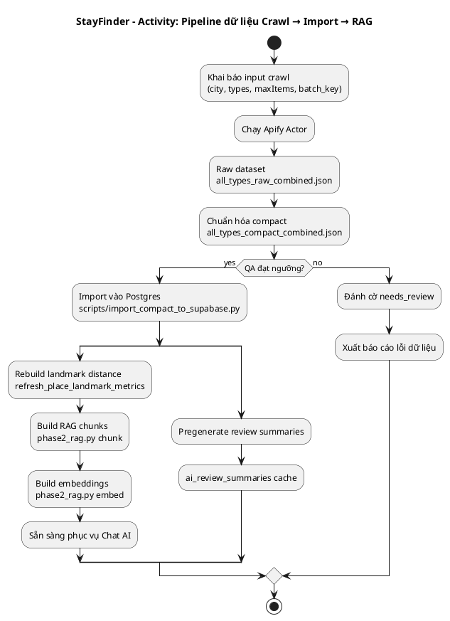

*Hình 8. Activity Diagram pipeline dữ liệu*

### ***4.2. Chuẩn hóa compact***

Compact JSON giữ các trường cốt lõi: `place_id, title, type_slug, type_label, address, neighborhood, district, lat, lng, rating, reviews_count, price_text, phone, website, images[] (đã filter), amenities[], reviews[]`. Loại bỏ:

- `raw_payload` chi tiết của reviewer.
- Trường tạp / không có giá trị cho UI.
- URL ảnh có marker xấu (`streetviewpixels-pa.googleapis.com`, `/gps-cs-s/`, `/geougc-cs/`).

### ***4.3. Import idempotent***

Quy tắc:

1. UPSERT `crawl_batches` theo `batch_key`.
2. UPSERT `places` theo `place_id`.
3. **Delete + Insert** `place_images` và `place_amenities` (đơn giản, không sợ orphan).
4. UPSERT `reviews` theo `(place_id, source_review_id)`.
5. Mọi bước trong transaction nhỏ (một place / một transaction).

### ***4.4. Pipeline RAG chi tiết***

**Bước 1 — Chunking**

- Compose văn bản chunk cho mỗi place gồm:
  - Header: tên, loại, địa chỉ.
  - Số liệu: rating, reviews_count, hotel_stars.
  - Amenities chính (max 8 nhãn).
  - 3 review cues giàu thông tin nhất.
  - Landmark phrases: `"cách Cầu Rồng ~1.2 km"`.
  - Local context tags: `"khu phố Tây An Thượng, gần biển Mỹ Khê"`.
- Cắt thành 1–3 chunk, mỗi chunk ~800–1200 ký tự.
- Tính `content_md5` để dedupe khi rebuild.

**Bước 2 — Embedding**

- Gọi embedding model 1536-dim qua provider OpenAI-compatible.
- Batch 16–32 chunk/request.
- Lưu vector vào `ai_place_chunks.embedding`.

**Bước 3 — Query / Generate**

> **Nguồn PlantUML:** `docs/bao-cao-plantuml/fig10-rag-query-flow.puml` — dán toàn bộ khối dưới vào [PlantUML Online](https://www.plantuml.com/plantuml/uml/).

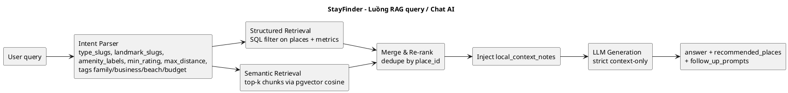

*Hình 10. Activity Diagram luồng Chat AI*

**Bước 4 — AI Review Summary**

- Lấy max 30 review/place (ưu tiên `likes_count` cao + `published_at` mới).
- Prompt LLM yêu cầu output JSON `{ summary_text, bullets[] }`.
- Validate JSON, upsert vào `ai_review_summaries`.

### ***4.5. Guardrails chống hallucination***

- Prompt system: *"Chỉ dùng dữ liệu trong CONTEXT, KHÔNG bịa địa điểm, KHÔNG khẳng định giá/khoảng cách/tiện ích ngoài dữ liệu cung cấp."*
- Verify post-generation: với mỗi place mentioned trong `answer`, kiểm tra có trong `recommended_places` không.
- Nếu generate lỗi → fallback template từ SQL shortlist.

## **5. Thiết kế UML**

### ***5.1. Class Diagram (Logical / Domain)***

> **Nguồn PlantUML:** `docs/bao-cao-plantuml/fig07-class-domain.puml` — dán toàn bộ khối dưới vào [PlantUML Online](https://www.plantuml.com/plantuml/uml/).

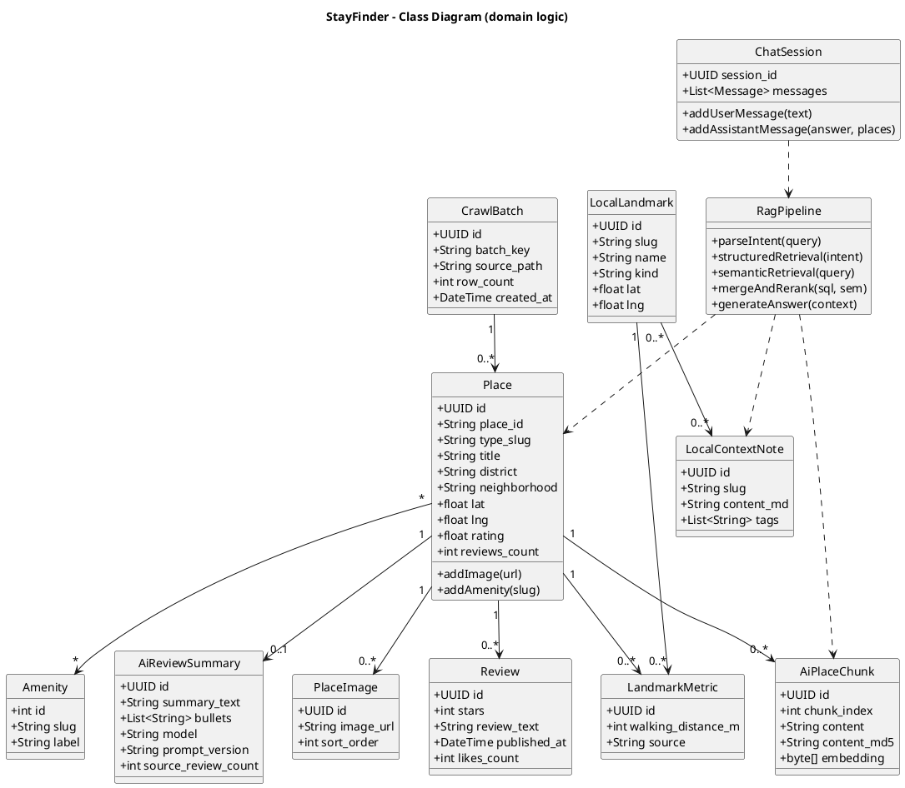

*Hình 7. Class Diagram domain*

### ***5.2. Activity Diagram: Tìm kiếm và xem chi tiết (UC-01 → UC-03)***

> **Nguồn PlantUML:** `docs/bao-cao-plantuml/fig09-activity-search-detail.puml` — dán toàn bộ khối dưới vào [PlantUML Online](https://www.plantuml.com/plantuml/uml/).

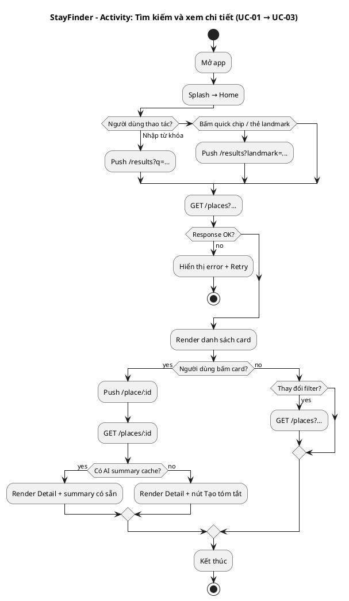

*Hình 9. Activity Diagram: luồng tìm kiếm & xem chi tiết*

### ***5.3. Sequence Diagram: GET /places (Search)***

> **Nguồn PlantUML:** `docs/bao-cao-plantuml/fig11-seq-get-places.puml` — dán toàn bộ khối dưới vào [PlantUML Online](https://www.plantuml.com/plantuml/uml/).

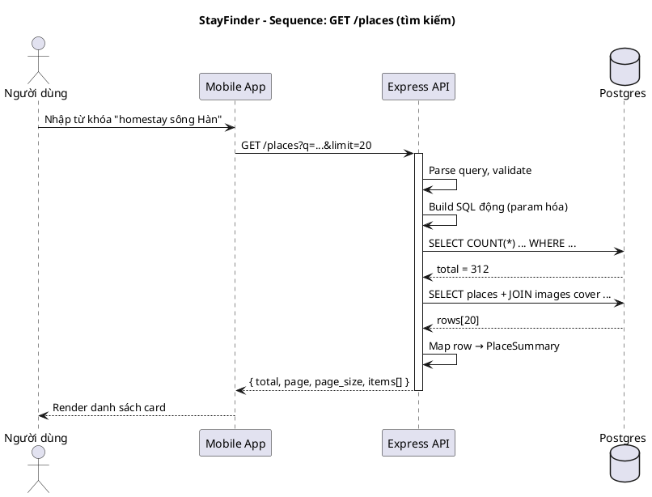

*Hình 11. Sequence Diagram: GET /places*

### ***5.4. Sequence Diagram: GET /places/:id (Detail)***

> **Nguồn PlantUML:** `docs/bao-cao-plantuml/fig12-seq-get-place-detail.puml` — dán toàn bộ khối dưới vào [PlantUML Online](https://www.plantuml.com/plantuml/uml/).

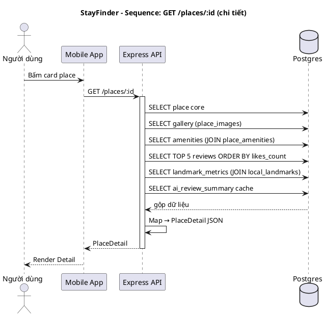

*Hình 12. Sequence Diagram: GET /places/:id*

### ***5.5. Sequence Diagram: POST /chat/query (Chat AI RAG)***

> **Nguồn PlantUML:** `docs/bao-cao-plantuml/fig13-seq-chat-query.puml` — dán toàn bộ khối dưới vào [PlantUML Online](https://www.plantuml.com/plantuml/uml/).

```plantuml
@startuml fig13-seq-chat-query
title StayFinder - Sequence: POST /chat/query (Chat AI RAG)
actor "Người dùng" as U
participant "Mobile App" as M
participant "Express API" as API
participant "RAG Script\n(Python)" as RAG
database "Postgres" as DB
cloud "LLM Provider" as LLM

U -> M : "khách sạn gần cầu rồng cho gia đình"
M -> API : POST /chat/query { query }
activate API
API -> RAG : spawn phase2_rag.py query --json ...
activate RAG
RAG -> RAG : parseIntent(query)
RAG -> DB : Structured retrieval (SQL filter)
DB --> RAG : candidates[24]
RAG -> DB : Semantic retrieval top-k (pgvector)
DB --> RAG : chunks[12]
RAG -> RAG : mergeAndRerank by place_id
RAG -> DB : Fetch local_context_notes
DB --> RAG : notes[3]
RAG -> LLM : Prompt (context = shortlist + notes)
LLM --> RAG : answer text
RAG --> API : JSON { answer, place_ids, ... }
deactivate RAG
API -> DB : Fetch PlaceSummary[] theo place_ids
DB --> API : recommended_places[]
API --> M : answer + recommended_places + follow_up_prompts
deactivate API
M --> U : Render chat + cards

@enduml
```

*Hình 13. Sequence Diagram: POST /chat/query*

### ***5.6. Sequence Diagram: POST /ai/review-summary***

> **Nguồn PlantUML:** `docs/bao-cao-plantuml/fig14-seq-review-summary.puml` — dán toàn bộ khối dưới vào [PlantUML Online](https://www.plantuml.com/plantuml/uml/).

```plantuml
@startuml fig14-seq-review-summary
title StayFinder - Sequence: POST /ai/review-summary
actor "Người dùng" as U
participant "Mobile App" as M
participant "Express API" as API
participant "Review Summary Bot" as Bot
database "Postgres" as DB
cloud "LLM Provider" as LLM

U -> M : Bấm "Tạo tóm tắt AI"
M -> API : POST /ai/review-summary { placeId, refresh:false }
activate API
API -> DB : SELECT cache ai_review_summaries
DB --> API : cache hoặc null

alt Có cache và chưa refresh
  API --> M : trả cache (source = cache)
else Cần sinh mới
  API -> Bot : spawn pregenerate / phase2
  activate Bot
  Bot -> DB : SELECT TOP 30 reviews
  DB --> Bot : reviews[]
  Bot -> LLM : Prompt JSON output
  LLM --> Bot : text JSON
  Bot -> Bot : Parse + validate
  Bot -> DB : UPSERT ai_review_summaries
  Bot --> API : summary mới
  deactivate Bot
  API --> M : source = fresh
end

deactivate API
M --> U : Render AI Summary

@enduml
```

*Hình 14. Sequence Diagram: POST /ai/review-summary*

### ***5.7. State Diagram: vòng đời cache AI review summary***

> **Nguồn PlantUML:** `docs/bao-cao-plantuml/fig15-state-ai-summary-cache.puml` — dán toàn bộ khối dưới vào [PlantUML Online](https://www.plantuml.com/plantuml/uml/).

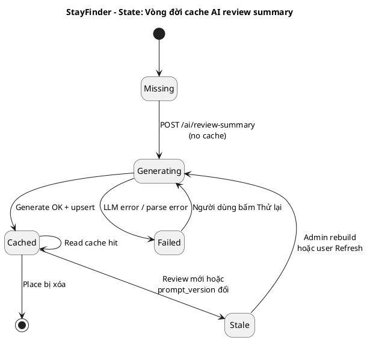

*Hình 15. State Diagram: vòng đời cache AI summary*

### ***5.8. Deployment Diagram***

> **Nguồn PlantUML:** `docs/bao-cao-plantuml/fig16-deployment.puml` — dán toàn bộ khối dưới vào [PlantUML Online](https://www.plantuml.com/plantuml/uml/).

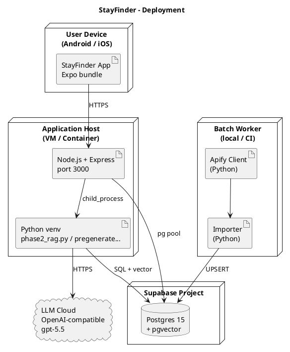

*Hình 16. Sơ đồ triển khai*

## **6. Thiết kế bảo mật và xử lý lỗi**

### ***6.1. Bảo mật API***

- **CORS allowlist** qua biến môi trường `CORS_ORIGINS`.
- **Admin auth**: header `Authorization: Bearer <ADMIN_API_TOKEN>` hoặc `x-admin-token`. Middleware kiểm tra trước khi tới route handler.
- **Parameterized SQL**: dùng `pg` parameter `$1, $2, …`, tuyệt đối không nối chuỗi.
- **Validate input**: ép kiểu (`parseInteger`, `parseFloatNumber`, `parseStringList`), reject giá trị ngoài enum hợp lệ.
- **Rate limit cơ bản** (tùy chọn mở rộng) ở mức endpoint chat/AI để chống abuse.

### ***6.2. Bảo mật dữ liệu***

- **RLS** bật trên các bảng public-read; service role chỉ dùng bên trong backend.
- **Không expose `raw_payload`** của places và `payload` của reviews.
- **Không log query** chứa token admin.

### ***6.3. Xử lý lỗi và độ tin cậy***

- **Error normalization**: mọi response lỗi đều dạng `{ error: { code, message } }`.
- **Timeout client**: mobile dùng `AbortController` 8s cho GET, 30–45s cho AI.
- **Fallback AI**: chat trả structured-only answer khi LLM lỗi.
- **Job retention**: in-memory `adminJobs` Map, TTL 30 phút.
- **Retry exponential** ở phía script Python khi gọi embedding/LLM bị rate-limit.

### ***6.4. Quan sát được (Observability)***

- Mỗi place trong API trả về có thể truy nguyên về `batch_id`.
- Mỗi AI summary lưu `model`, `prompt_version`, `source_review_count`.
- Mỗi chunk lưu `content_md5` để biết khi nào cần reembed.
- Admin job lưu `started_at`, `finished_at`, `status`, `error?`.

---

# **CHƯƠNG 3: DEMO GIAO DIỆN ỨNG DỤNG**

## **1. Giao diện Splash**

Màn Splash hiển thị logo và slogan của StayFinder ngay khi mở app. Splash đảm nhận hai vai trò: tạo dấu ấn thương hiệu và "che" thời gian preload các dữ liệu meta (`/filters/meta`, `/landmarks`). Sau ~1.5 giây hoặc khi dữ liệu meta sẵn sàng, app điều hướng vào tab Home.

*Hình 17. Giao diện Splash*

## **2. Giao diện Home / Tìm kiếm nhanh**

Home là điểm vào chính:

- **Brand Header**: logo StayFinder.
- **Ô tìm kiếm nổi bật**: text input chiếm chiều ngang, dễ thao tác một tay.
- **Quick chips**: 4–6 chip — "Gần biển", "Gần sân bay", "Gia đình", "Giá ổn", "Phố Tây", "View sông Hàn".
- **Thẻ landmark nổi bật**: ảnh + tên — Cầu Rồng, Cầu Sông Hàn, Mỹ Khê, Ngũ Hành Sơn, An Thượng, Sơn Trà, Sân bay, Chợ Hàn.
- **Section "Nổi bật"**: top 10 place rating cao.
- **Section "Gợi ý gần biển"**: filter sẵn theo `landmark=my-khe-beach`.

UX: ưu tiên thao tác một tay, tỷ lệ ảnh card hợp lý (16:9 cover, 4:3 cho card nhỏ), padding nhất quán 16/20.

*Hình 18. Giao diện Home*

## **3. Giao diện Results / Filter Sheet**

Results gồm:

- **Header**: số kết quả, nút Map, nút Filter.
- **Sort dropdown**: "Rating cao", "Nhiều review", "Gần nhất", "Tên A-Z".
- **Filter chips trên list**: hiển thị filter đang áp dụng để dễ remove từng cái.
- **Danh sách card**: ảnh cover, tên, rating, lượng review, district, 3 amenity preview, distance tới landmark đang lọc.
- **Empty State**: icon + thông điệp + nút "Đặt lại bộ lọc".

Filter Sheet (modal trượt từ dưới lên) gồm:

- Chọn nhiều loại hình.
- Chọn quận.
- Chọn neighborhood.
- Chọn nhiều amenity.
- Chọn landmark + slider `max_distance_m`.
- Slider `min_rating`.
- Nút "Đặt lại" + "Áp dụng".

*Hình 19. Giao diện Results / Filter Sheet*

## **4. Giao diện Place Detail**

Place Detail là màn quan trọng nhất, gồm 6 block chính:

1. **Hero**: ảnh cover full-width, badge loại, nút Back overlay.
2. **Header info**: tên place, rating + lượng review, địa chỉ ngắn.
3. **Action bar**: Lưu / Gọi điện / Mở website / Mở Maps.
4. **Tags & Amenities**: chip nổi bật ("Gần biển", "Wifi", "Hồ bơi") + list amenity đầy đủ.
5. **Khoảng cách tới landmark**: list landmark + distance đã format ("Cầu Rồng • 1.2 km").
6. **Reviews & AI Summary**:
   - Block AI Review Summary (text + bullets + nút "Xem chi tiết AI").
   - Section 3–5 review mẫu (avatar ẩn theo policy, stars, text, ngày).
7. **Gallery**: scroll ngang thumbnails.
8. **Mini map** (tùy chọn): hiển thị marker place + landmark gần nhất.

*Hình 20. Giao diện Place Detail*

## **5. Giao diện AI Review Summary mở rộng**

Khi bấm "Xem chi tiết AI" ở Detail, app mở `/ai-review/[place-id]`:

- Header: tên place + nút Back.
- Block 1: summary_text dạng paragraph lớn, dễ đọc.
- Block 2: bullets với icon (✓ điểm mạnh, ✗ điểm yếu, ℹ lưu ý).
- Block 3: metadata "Tóm tắt bởi `gpt-5.5`, dựa trên N review, cập nhật lúc …".
- Nút "Tạo lại tóm tắt" — refresh cache.

*Hình 21. Giao diện AI Review Summary*

## **6. Giao diện Chat AI**

Chat AI là một trong những điểm nhấn UX của StayFinder:

- **Bong bóng chào**: trợ lý mở đầu "Mình có thể giúp bạn tìm nơi ở phù hợp tại Đà Nẵng. Bạn cần gì nào?".
- **Prompt mẫu**: 4–6 chip ("Gần biển cho gia đình", "Gần sân bay cho khách công tác", "Phố Tây An Thượng", "View đẹp ven sông Hàn", "Giá vừa phải dưới 800k", "Có hồ bơi cho trẻ em").
- **Bong bóng tin nhắn**: phân biệt user (phải, màu chính) / assistant (trái, màu nền).
- **Typing indicator**: 3 chấm nhấp nháy trong khi đợi response.
- **Carousel cards**: ngay dưới bong bóng AI, hiển thị 3–5 place gợi ý, bấm vào → Detail.
- **Chip follow-up**: phía dưới bong bóng AI cuối cùng, gợi ý 2–3 câu hỏi mở rộng.
- **Input box**: text input + nút Send disabled khi rỗng.

Animation: bong bóng xuất hiện dần (slide-up + fade-in 200 ms) tạo cảm giác mượt.

*Hình 22. Giao diện Chat AI*

## **7. Giao diện Saved**

- Danh sách card lớn (ảnh + tên + district + rating).
- Vuốt sang trái để xóa, kèm haptic feedback.
- Empty State: "Bạn chưa lưu địa điểm nào. Hãy thử trái tim trên màn chi tiết."

*Hình 23. Giao diện Saved*

## **8. Giao diện Profile**

- Avatar mặc định + label "Khách" (vì v1 không login).
- Thống kê nhanh: số chỗ đã lưu, số phiên Chat AI gần đây, vùng quan tâm (auto-detect từ filter hay dùng).
- Điều hướng: vào Saved, vào Chat AI gần nhất, mở Settings (về app, phiên bản).

*Hình 24. Giao diện Profile*

## **9. Đánh giá UI/UX tổng thể**

- **Bố cục nhất quán**: padding 16/20, radius 12/16, shadow nhẹ.
- **Hệ màu**: dùng tone biển + sông (xanh đậm + xanh ngọc) làm chủ đạo, phù hợp brand Đà Nẵng.
- **Thông tin ưu tiên**: vị trí → chất lượng → tiện ích → giá → action.
- **Trạng thái rõ ràng**: mỗi màn có loading skeleton, empty state có hình minh họa, error state có nút Retry.
- **Hỗ trợ thao tác một tay**: nút quan trọng nằm dưới ⅓ màn hình.
- **Tiếng Việt thuần**: tất cả label dùng tiếng Việt có dấu.

---

# **KẾT LUẬN**

## **1. Kết quả đạt được**

Sau quá trình nghiên cứu, thiết kế và triển khai đồ án **"Xây dựng ứng dụng mobile StayFinder tìm chỗ ở thông minh tại Đà Nẵng, tích hợp AI/RAG"**, đề tài đã đạt được những kết quả chính sau:

**Về mặt dữ liệu**

- Xây dựng thành công pipeline crawl → chuẩn hóa → import idempotent, với batch v1 `danang_accommodations_batch_20260323_082743` gồm 1.646+ địa điểm Đà Nẵng.
- Chuẩn hóa thành **2 lớp dataset** rõ ràng: `raw` (audit/forensic) và `compact` (source of truth cho app/API).
- Thiết kế và migrate schema PostgreSQL 11 bảng có quan hệ chặt chẽ, có index hợp lý và bật RLS public-read.
- Precompute khoảng cách Haversine từ mỗi place tới 8 landmark Đà Nẵng quan trọng, hỗ trợ landmark dạng zone (Sơn Trà, An Thượng) với multi-anchor.

**Về mặt backend**

- Triển khai **REST API hoàn chỉnh** với 8 endpoint public và 10+ endpoint admin, bao trùm CRUD places/landmarks/notes, filter/sort/pagination, AI chat và AI review summary.
- Hệ thống **admin job manager nội bộ** cho 4 loại job (distance, chunks, embeddings, review-summaries), hỗ trợ chạy nền và đồng bộ.
- Chuẩn hóa **hợp đồng dữ liệu** giữa backend ↔ mobile (PlaceSummary, PlaceDetail, FiltersMeta, LandmarkMetric, ChatResponse, ReviewSummaryResponse).

**Về mặt AI/RAG**

- Xây dựng pipeline RAG hoàn chỉnh: **chunk → embed → query** với pgvector 1536-dim.
- Triển khai **hybrid retrieval** (SQL filter + semantic) đảm bảo câu trả lời vừa chính xác (theo điều kiện cứng) vừa linh hoạt (theo ngữ cảnh mềm).
- **AI Review Summary** sinh tóm tắt review theo từng place, có cache `ai_review_summaries` để tối ưu thời gian phản hồi.
- Áp dụng các **guardrails chống hallucination**: không bịa địa điểm, không suy diễn giá/khoảng cách/tiện ích ngoài DB, có fallback structured-only khi LLM lỗi.

**Về mặt mobile**

- Xây dựng app đa nền tảng bằng **React Native + Expo Router + TypeScript** với 9 màn hình chính: Splash, Home, Results, Filter Sheet, Place Detail, AI Review, Chat AI, Saved, Profile.
- Đảm bảo **trải nghiệm UX nhất quán**: loading/empty/error state đầy đủ, ảnh fallback, haptic feedback, animation 60 FPS.
- Tích hợp **Saved local** bằng AsyncStorage, hỗ trợ vuốt xóa nhanh.

**Về mặt kỹ thuật chung**

- Toàn bộ schema được quản lý qua **migrations version-controlled** trong `supabase/migrations/`.
- Pipeline **idempotent**: chạy lại cùng batch không tạo trùng; place đã có → update.
- **Quan sát được**: mọi place trong app truy vết về batch cụ thể; mọi AI output có metadata `model`, `prompt_version`, `source_review_count`.

## **2. Hạn chế**

Bên cạnh các kết quả đạt được, đồ án vẫn còn một số hạn chế nhất định:

- **Phạm vi địa lý hẹp**: chỉ phục vụ Đà Nẵng trong v1; chưa mở rộng các thành phố khác như Hà Nội, Hồ Chí Minh, Hội An.
- **Chưa có hệ thống đăng nhập/đồng bộ cloud**: Saved chỉ lưu local, người dùng đổi thiết bị sẽ mất danh sách yêu thích.
- **Chưa có push notification**: chưa hỗ trợ thông báo khi có batch dữ liệu mới hoặc khi giá thay đổi.
- **Phụ thuộc LLM bên ngoài**: chi phí có thể tăng khi quy mô lớn; cần lập kế hoạch cache/optimize sâu hơn.
- **Map view chưa offline**: cần kết nối Internet để load tile map.
- **Web admin tối giản**: mới đủ cho demo, chưa có chức năng audit log, role-based access control phức tạp.
- **Chưa có booking/payment**: chỉ là place discovery, không phải OTA.

## **3. Hướng phát triển**

Đồ án mở ra nhiều hướng phát triển tiếp theo, có thể thực hiện trong các đồ án/luận văn kế tiếp:

- **Mở rộng đa thành phố**: thêm Hà Nội, Hồ Chí Minh, Hội An, Huế. Schema hiện đã chuẩn bị tốt cho hướng này (`places.city`, batch_key linh hoạt).
- **User account và đồng bộ cloud**: thêm Supabase Auth để đồng bộ Saved, lịch sử Chat AI, sở thích cá nhân.
- **Push notification**: thông báo batch dữ liệu mới, khuyến mãi giả lập, gợi ý lưu trú dựa trên lịch sử.
- **Booking integration**: tích hợp deep link tới các OTA (Booking, Agoda) để người dùng đặt phòng ngay từ Detail.
- **Cá nhân hóa AI**: học từ lịch sử Chat và Saved để gợi ý thông minh hơn (recommendation system).
- **OSRM cho khoảng cách đường đi thực tế**: thay vì Haversine đường chim bay, dùng OSRM để có khoảng cách walking/driving thực.
- **Multimodal AI**: phân tích ảnh place để gợi ý "phong cách" (cổ điển, hiện đại, gần thiên nhiên,…).
- **Voice search & voice chat**: cho phép hỏi bằng giọng nói.
- **Dashboard admin nâng cấp**: thêm biểu đồ batch, độ phủ landmark, tỉ lệ AI summary lỗi, chart hoạt động user.
- **Optimize chi phí AI**: cache aggressive hơn, quantize embedding, dùng model nhỏ hơn cho intent parsing.

Với nền tảng dữ liệu, kiến trúc và pipeline AI đã được thiết kế đồng bộ ngay từ đầu, StayFinder đủ vững chắc để tiếp tục phát triển lên các phiên bản kế tiếp.

---

# **TÀI LIỆU THAM KHẢO**

**1. Tài liệu về React Native và Expo**

- React Native Documentation — *Learn once, write anywhere*: <https://reactnative.dev/docs/getting-started>
- Expo Documentation — *Expo SDK Reference*: <https://docs.expo.dev/>
- Expo Router — *File-based router for React Native*: <https://expo.github.io/router/docs/>
- React Navigation — *Routing and Navigation for React Native*: <https://reactnavigation.org/>
- React Native Reanimated — <https://docs.swmansion.com/react-native-reanimated/>

**2. Tài liệu về TypeScript**

- TypeScript Handbook — <https://www.typescriptlang.org/docs/handbook/intro.html>
- TypeScript Cheat Sheets — <https://www.typescriptlang.org/cheatsheets>

**3. Tài liệu về Backend Node.js & Express**

- Node.js Docs — <https://nodejs.org/en/docs>
- Express.js Guide — <https://expressjs.com/>
- node-postgres (pg) — <https://node-postgres.com/>

**4. Tài liệu về PostgreSQL và Supabase**

- PostgreSQL 15 Documentation — <https://www.postgresql.org/docs/15/>
- Supabase Docs — <https://supabase.com/docs>
- Supabase CLI Migrations — <https://supabase.com/docs/guides/cli/local-development>
- pgvector — *Open-source vector similarity search for Postgres*: <https://github.com/pgvector/pgvector>

**5. Tài liệu về AI / RAG / LLM**

- LangChain Documentation — <https://python.langchain.com/docs/introduction/>
- OpenAI API Reference — <https://platform.openai.com/docs/api-reference>
- Retrieval-Augmented Generation (Lewis et al., 2020) — <https://arxiv.org/abs/2005.11401>
- Hierarchical Navigable Small World (HNSW) — Malkov & Yashunin, 2018.

**6. Tài liệu về Apify**

- Apify Documentation — <https://docs.apify.com/>
- Apify Google Maps Crawler Actor — <https://apify.com/compass/crawler-google-places>

**7. Tài liệu về UML và Mermaid**

- UML Diagrams — <https://www.uml-diagrams.org/>
- Mermaid — <https://mermaid.js.org/>
- PlantUML — <https://plantuml.com/>

**8. Tài liệu nội bộ dự án**

- `README.md`: hướng dẫn tổng quan workspace StayFinder.
- `PLAN.md`: master roadmap toàn dự án (6 phase).
- `docs/phase-0-db-import-runbook.md`: runbook migrate/import/verify DB.
- `docs/phase-2-rag-runbook.md`: runbook build chunk/embed/query RAG.
- `supabase/migrations/*.sql`: schema baseline + landmark + RAG support.
- `docs/uml/*.puml`: bộ sơ đồ PlantUML (context, container, components, sequence, activity, state, class, deployment).
